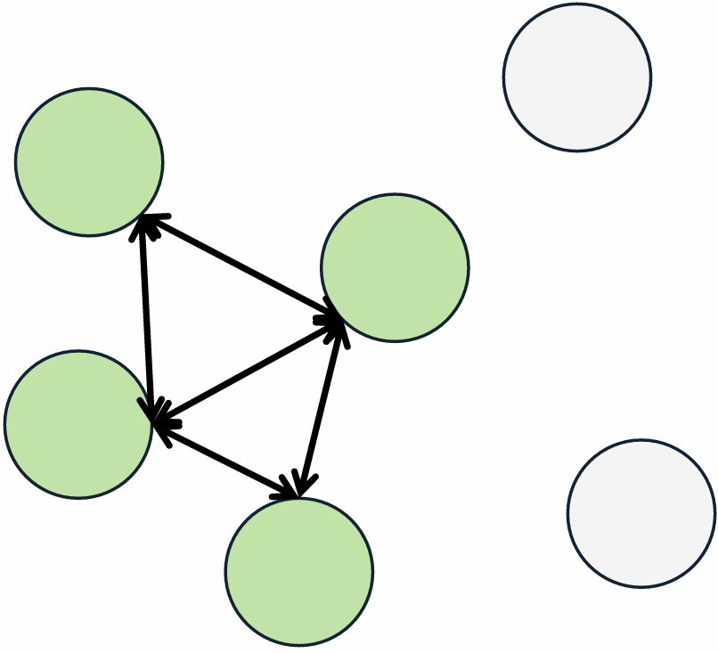



::: notes
Hello and Welcome to Spatial Pop Modeling. My name is Mahdie Tournai, an assistant
prof of Q Ecol in the WBIO program, happy to see you this semester.
:::

# Where we're going {.center}
::: notes
Today, we start by a round of introduction
then, we talk about the role of space
and how and when spatial concepts where incorporated into ecology.

We'll also talk about this course and go through the syllabus.

:::

## Roadmap for today

1.  The role of space in ecology and conservation
2.  Trajectory of spatial modeling frameworks
3.  The shape of the rest of the semester

::: notes
This might be the only lecture in the course with no real analysis in it. 
so I hope the conceptual density doesn't feel like busywork.

Ask up front: "How many of you have data with xy coordinates?" Almost every hand goes up.
Why do you think your data includes that information?

Space is not just a passive background; it is an active player that shapes interactions, dispersal, and evolutionary trajectories.

This lesson is a gentle introduction to the role of space and trajectory of incorporating space into ecology.
:::

## Introduction {#hook-setup}

::: activity
1.  What is your name?
2.  What do you study?
3.  What is your favourite café in Missoula?
:::

{fig-align="right" width="10%"}

::: notes
Before we go further, let's take a few minutes for introductions. Please introduce yourself to the class, say what you study, and what is your fav cafe in Missoula!
:::


# 1.1 The Role of Space

## Tobler's First Law of Geography

> "Everything is related to everything else, but near things are more related than distant things."

This means that samples from nearby locations are more similar than samples far apart.

::: notes
The first spatial concept is what is known as Tobler's first law of geography. 

In this class, but more broadly in spatial ecology we borrow a lot from geography.

This statement means that geography is never random. If you sample two points close to each other, they are likely to be similar simply because of their proximity. Your favorite cafe is likely to be the same as your neighbors cafe and less likely to be the same as MSU students living in Bozeman.

Fun fact about Tobler is that he was a cartographer and statistician published the first paper on using computers for making maps.
:::

{fig-align="right" width="10%"}

## Space: the final frontier

> Kareiva opened a 1994 *Ecology* editorial by calling space the final frontier for ecological theory.

Ecology had been about space (e.g., Darwin's entangled bank and Hutchinson's ecological theater).

- What changed in the 1990s was not the recognition that space matters. It was the arrival of **data that were spatially explicit** and **models that could use them**.

::: notes
In ecology, space has been called the final frontier. 

This is what Kareiva wrote in 1994 in a one-page Ecology editorial piece "Space: the final frontier for ecological theory".

Darwin's entangled bank: Plants, bugs, birds, and worms depend on each other and compete for survival in a shared space. The "entangled bank" is the famous final-paragraph metaphor in Charles Darwin’s On the Origin of Species.

Likewise, Hutchinson's ecological theatre refers to habitat/space limits as a driving force for species dynamics.

Kareiva's phrase is a Star Trek reference and if you are under 30 you might miss it. The joke is that it arrived 40-ish years later.

The point is that spatial ecology was not a conceptual breakthrough. It was overwhelmingly a data-and-computation breakthrough applied to concepts that Watt had articulated in 1947. 
The field simply had not built the tools to say so quantitatively.

new methods in this field usually follow new data, not new theory.


:::

{width="45%"} {width="20%"} {width="24%"}

<!-- ## Spatial ecology as a discipline -->

<!-- **Spatial ecology** is the study of how space directly and indirectly affects biodiversity, species distributions, and ecosystem functioning. -->

<!-- - The term was coined by **Tilman and Kareiva in 1997**, in an edited volume on the role of space in population dynamics and interspecific interactions. -->

<!-- - A dozen fields converged on the same problem from different directions. It bridges various life science subdisciplines: population ecology, community ecology, landscape ecology, and macroecology. -->

<!-- ::: notes -->

<!-- - But the intellectual lineage runs back much further — Darwin's entangled bank, Hutchinson's ecological theater -->

<!-- - Since 1997 the term has been used differently by nearly every subdiscipline that adopted it -->

<!-- - Useful point: "spatial ecology" is younger than most of your students. The field naming itself in 1997 is recent enough that the founding figures are still publishing. -->

<!-- Since then the term has been used in almost as many ways as there are subdisciplines using it. That is not sloppiness — it reflects the fact that a dozen fields converged on the same problem from different directions. -->

<!-- ::: -->

## Spatial ecology

> "The study and modeling of the role(s) of space on ecological processes, which in turn affect ecological patterns."

Definition by Fletcher & Fortin, 2018

{fig-align="right" width="35%"}

::: notes
- The term was coined by **Tilman and Kareiva in 1997**, in an edited volume on the role of space in population dynamics and interspecific interactions.

- "spatial ecology" is younger than most of your students. The field naming itself in 1997 is recent enough that the founding figures are still publishing
:::

## Processes and patterns

We usually observe the pattern and want to infer the process.

- Space acts on **processes** (dispersal, competition, demography)

- Processes generate **patterns** (distributions, abundance surfaces)

  process → pattern → inference

::: notes
- space acts on *processes*, and processes generate *patterns*. The arrow runs process to pattern.

Almost everything we do analytically runs the arrow backwards — we observe pattern and try to infer process. Many processes can generate the same pattern.
:::

<!--

## Spatial patterns

Heterogeneous environment could lead to spatial patterns:

- Organism responses to structured environment (**exogenous processes**): Climate, local habitat features, microhabitat heterogeneity, patch disturbance and succession

- Even in a completely homogeneous environment, **endogenous processes** alone can generate spatial structure.

- Both operate simultaneously, and they interact

::: notes
There are two engines for spatial patterns we observe. **Exogenous processes** are organism responses to environmental factors that are themselves spatially structured. external vs internal

**Endogenous processes**

- Movement, dispersal, migration

- Demography, genetic variation, behavior

- Competition, facilitation, trophic interactions

  The environment is not a random backdrop. It is **already autocorrelated** before any organism responds to it — and that inherited structure passes straight into the species pattern.

:::
-->
<!-- ## Key Questions in Spatial Ecology -->

<!-- - How do species distribute themselves across geographic gradients? -->

<!-- - How do barriers and corridors influence movement and genetic flow? -->

<!-- - How does habitat fragmentation affect population viability? -->

<!-- - How do local species interactions scale up to determine regional diversity? -->

<!-- ::: notes -->

<!-- Speaker Notes: These core questions represent the intersection of ecology and conservation. Over the past few decades, the development of GIS, remote sensing, and advanced spatial statistics has allowed us to move from purely theoretical ideas to robust, data-driven spatial models that directly support decision-making. Which question is studying pattern and which is about a process? -->

<!-- ::: -->

# 1.2 Why Space Matters in Ecology?

## Space in Ecology: dependence

> All aspects of ecology play out in space.

If space is inherent to every ecological process, then any analysis that assumes observations are independent and identically located is making a claim about biology which is usually false.

::: notes
In ecology, we know that space is inherent to every ecol process. This is one sentence to hang the semester on.

If you find a Wood Turtle in a specific stream reach, the odds of finding another one ten meters away are much higher than finding one ten kilometers away. This is Tobler’s Law.

In statistics, this creates a "nuisance" because if our samples aren't independent, we are essentially "double-counting" our data, which makes our results look more significant than they really are

Would that be a type I or type II error? False positives
:::

## Space in Ecology: scale

> All aspects of ecology play out in space.

Spatial structure can alter outcomes of ecological studies.

::: notes
Ignoring space isn't a neutral simplification, it's rather an assumption that location carries no information. Almost nobody would defend that claim out loud, yet it's baked into most standard models.

Consider the Wood Turtle: it needs instream habitat for winter, riparian areas for spring, and upland sites for summer foraging. It operates across an entire watershed mosaic. If we only study the turtle at the "microhabitat" scale (the logs it sits on), we miss the "landscape" scale (the connectivity between the river and the forest) that it needs to survive its 50+ year lifespan
:::

{fig-align="right"}

## Space-environment relationship

**SA-env**: Spatial structure of the environment  

**SD**: Spatial dependence of species response to spatially structured environment  

**SA-sp**: Spatial autocorrelation of the species

```{r, echo=FALSE}
#| autorun: true
#| fig-alt: "Triangle diagram. A node labelled Space sits at the top. Arrows run from Space down-left to Environment, labelled SA-env, and down-right to Species, labelled SA-sp. A third arrow runs from Environment across to Species, labelled SD."
op <- par(mar = c(0, 0, 1, 0))
plot(NA, xlim = c(-1.5, 1.5), ylim = c(-1.0, 1.15),
     asp = 1, axes = FALSE, xlab = "", ylab = "")

nx <- c(0, -1.0, 1.0); ny <- c(0.85, -0.65, -0.65)
nm <- c("Environment", "Space", "Species")
cl <- c("#1D3C34","#70002E", "#1D3C34")

arrows(
       nx[2] + 0.34,
       ny[2] + 0.20,
       nx[1] - 0.14,
       ny[1] - 0.16,
       lwd = 3, length = 0.14, col = "#333333")
arrows(nx[1] + 0.14,
       ny[1] - 0.16,
       nx[3] - 0.34,
       ny[3] + 0.20,
       lwd = 3, length = 0.14, col = "#333333")
arrows(nx[2] + 0.46, 
       ny[2],
       nx[3] - 0.46,
       ny[3],
       lwd = 3, length = 0.14, col = "#333333")


text(-0.74,  0.16, "SA-env", srt = 47,  cex = 0.80, font = 2, col = "#70002E")
text( 0.74,  0.16, "SD",  srt = -47, cex = 0.80, font = 2, col = "#70002E")
text( 0.00, -0.53, "SA-sp",                cex = 0.80, font = 2, col = "#70002E")

for (i in 1:3) {
  rect(nx[i] - 0.45, ny[i] - 0.15, nx[i] + 0.45, ny[i] + 0.15,
       col = "#EFE8D4", border = cl[i], lwd = 3)
  text(nx[i], ny[i], nm[i], font = 2, cex = 0.92, col = "#333333")
}
par(op)
```

::: notes

Space affects species patterns directly and indirectly.
Let's talk about this arrow.
SD — spatial dependence:
This is the arrow ecologists usually want to estimate. It is the habitat association, the resource selection coefficient, the niche relationship.

The problem: SD is measured in a system where SA-env and SA-sp are both operating, and all three arrows produce the same patterns.

:::

## Spatial pattern: SA-env

**SA-env**: Spatial structure of the environment  

>SA-env is a property of the world, not of the sampling or the species.

```{r, echo=FALSE}
#| autorun: true
#| fig-alt: "Triangle diagram. A node labelled Space sits at the top. Arrows run from Space down-left to Environment, labelled SA-env, and down-right to Species, labelled SA-sp. A third arrow runs from Environment across to Species, labelled SD."
op <- par(mar = c(0, 0, 1, 0))
plot(NA, xlim = c(-1.5, 1.5), ylim = c(-1.0, 1.15),
     asp = 1, axes = FALSE, xlab = "", ylab = "")

nx <- c(0, -1.0, 1.0); ny <- c(0.85, -0.65, -0.65)
nm <- c("Environment", "Space", "Species")
cl <- c("#1D3C34","#70002E", "#1D3C34")

arrows(
       nx[2] + 0.34,
       ny[2] + 0.20,
       nx[1] - 0.14,
       ny[1] - 0.16,
       lwd = 3, length = 0.14, col = "#333333")
arrows(nx[1] + 0.14,
       ny[1] - 0.16,
       nx[3] - 0.34,
       ny[3] + 0.20,
       lwd = 3, length = 0.14, col = "#333333")
arrows(nx[2] + 0.46, 
       ny[2],
       nx[3] - 0.46,
       ny[3],
       lwd = 3, length = 0.14, col = "#333333")


text(-0.74,  0.16, "SA-env", srt = 47,  cex = 0.80, font = 2, col = "#70002E")
text( 0.74,  0.16, "SD",  srt = -47, cex = 0.80, font = 2, col = "#70002E")
text( 0.00, -0.53, "SA-sp",                cex = 0.80, font = 2, col = "#70002E")

for (i in 1:3) {
  rect(nx[i] - 0.45, ny[i] - 0.15, nx[i] + 0.45, ny[i] + 0.15,
       col = "#EFE8D4", border = cl[i], lwd = 3)
  text(nx[i], ny[i], nm[i], font = 2, cex = 0.92, col = "#333333")
}
par(op)
```

::: notes

-SA-env : The environment is autocorrelated for reasons that have nothing to do with your study organism. Elevation is smooth. Temperature is smooth. Soil type comes in patches because geology comes in patches.

Nearby places resemble each other environmentally, and that would be true if your species went extinct tomorrow.

what's the coldest place within 200 m of where you are sitting? The U.S. Forest Service building just off East Beckwith Avenue or Mansfield Library.

what's the coldest place within 200 km of where you are sitting? Glacier NP, Lost Trail Pass near Idaho border, 

The first is nearly the same temperature as the room; the second could be 20°C different. 
:::


## Spatial pattern: SA-sp

**SA-sp**: Spatial autocorrelation of the species  

>Organisms cluster for endogenous reasons: limited dispersal, territoriality, conspecific attraction, contagious reproduction, local demographic history.

```{r, echo=FALSE}
#| autorun: true
#| fig-alt: "Triangle diagram. A node labelled Space sits at the top. Arrows run from Space down-left to Environment, labelled SA-env, and down-right to Species, labelled SA-sp. A third arrow runs from Environment across to Species, labelled SD."
op <- par(mar = c(0, 0, 1, 0))
plot(NA, xlim = c(-1.5, 1.5), ylim = c(-1.0, 1.15),
     asp = 1, axes = FALSE, xlab = "", ylab = "")

nx <- c(0, -1.0, 1.0); ny <- c(0.85, -0.65, -0.65)
nm <- c("Environment", "Space", "Species")
cl <- c("#1D3C34","#70002E", "#1D3C34")

arrows(
       nx[2] + 0.34,
       ny[2] + 0.20,
       nx[1] - 0.14,
       ny[1] - 0.16,
       lwd = 3, length = 0.14, col = "#333333")
arrows(nx[1] + 0.14,
       ny[1] - 0.16,
       nx[3] - 0.34,
       ny[3] + 0.20,
       lwd = 3, length = 0.14, col = "#333333")
arrows(nx[2] + 0.46, 
       ny[2],
       nx[3] - 0.46,
       ny[3],
       lwd = 3, length = 0.14, col = "#333333")


text(-0.74,  0.16, "SA-env", srt = 47,  cex = 0.80, font = 2, col = "#70002E")
text( 0.74,  0.16, "SD",  srt = -47, cex = 0.80, font = 2, col = "#70002E")
text( 0.00, -0.53, "SA-sp",                cex = 0.80, font = 2, col = "#70002E")

for (i in 1:3) {
  rect(nx[i] - 0.45, ny[i] - 0.15, nx[i] + 0.45, ny[i] + 0.15,
       col = "#EFE8D4", border = cl[i], lwd = 3)
  text(nx[i], ny[i], nm[i], font = 2, cex = 0.92, col = "#333333")
}
par(op)
```

::: notes

-SA-sp: Organisms cluster for endogenous reasons: limited dispersal, territoriality, conspecific attraction, contagious reproduction, local demographic history.

This is the arrow that would still exist in a perfectly uniform environment.

"so how do you ever separate them?" with difficulty, with assumptions, and sometimes not at all — which is why experiments like Huffaker's, coming up in three slides, retain their value.

**Exogenous processes** are organism responses to environmental factors that are themselves spatially structured. Climate, local habitat features, microhabitat heterogeneity, patch disturbance and succession

**Endogenous processes**
- Movement, dispersal, migration
- Demography, genetic variation, behavior
- Competition, facilitation, trophic interactions

<!-- The environment is not a random backdrop. It is **already autocorrelated** before any organism responds to it — and that inherited structure passes straight into the species pattern. -->

:::

## Why does it matter?
All three produce similar maps, confusing them has direct costs:

- False positive error. Autocorrelated residuals violate independence; standard errors shrink, p-values shrink, and you discover relationships that are not there.

- Wrong mechanism. You attribute to habitat what dispersal produced, or vice versa.

- Bad extrapolation. A model fitted to a confounded signal predicts badly in a new landscape.

:::{.notes}

Autocorrelation means your effective sample size is smaller than your nominal sample size, sometimes by an order of magnitude.

Give the concrete version: 500 vegetation plots on a 30 m grid may carry the information of perhaps 40 independent plots. Everything downstream of that mistake is wrong in the same direction — too confident.

:::

## Activity

::: activity
**Format:** small groups of 2–3

**Materials:** one set of 11 cut cards per group, three labelled table zones (SA-env, SA-sp, SD)

Your group's job: **sort those 11 cards (real ecological statements) into SA-env, SA-sp, SD.** (8min) 
:::

::: notes
Print slide 60 on cardstock and cut into 11 cards; one set per pair, so
a class of 30 needs 15 sets. They laminate well and you will reuse them
every year.

Deliberately place three labelled zones on tables rather than having
students write answers. Physically moving a card is a commitment, and
commitments generate the arguments you want to overhear while
circulating.

Do not answer questions during phase 1. Write recurring ones on the
board and address them in phase 3.


preparation:

Sort each statement into **SA-env**, **SA-sp**, or **SD**.

1.  Wolverine detections cluster because juveniles settle near their
    natal range.
2.  Whitebark pine occurrence increases with elevation.
3.  Mean July temperature declines smoothly northward across Montana.
4.  Sage-grouse leks are clumped because displaying males aggregate.
5.  Bull trout occupy reaches where August stream temperature stays
    below 12 °C.
6.  Neighbouring stands share an age class because one 1910 fire burned
    them together.
7.  Lupine seedlings occur within a metre of parent plants because seeds
    fall short.
8.  Grizzly bear use increases in huckleberry-dominated cover.
9. Adjacent snow-course stations report similar snow water equivalent.
10. Two survey points 100 m apart record the same singing male.
11. Amphibian occupancy is higher in wetlands with longer hydroperiod.

Card 10 is the trap and it is the most valuable card in the set. It is
not biological aggregation at all — it is double-counting, a measurement
artefact that produces a signature identical to SA-sp.

Most pairs file it under SA-sp, which is defensible and gives you the
opening to make the point that the same pattern in data can arise from
biology or from sampling design, and the data cannot tell you which.
That is the honest version of what Chapter 5 does and does not deliver.

Card 6 is the second-best card: a legacy effect masquerading as an
environmental gradient.
:::

## Activity debrief
SA-env and SA-sp are things about the world; SD is the
thing we want to estimate; and card 10 is a reminder that some spatial
structure is about neither the world nor the organism but about study design.


::: notes
Do not simply read the key. Ask which cards produced disagreement and
work those only. A key read aloud teaches nothing; a disputed card
teaches a lot.

| Pile | Cards | Explanation |
|------------------------|------------------------|------------------------|
| **SA-env** | 3, 6, 9 | Environment structured for physical or historical reasons; no organism involved |
| **SA-sp** | 1, 4, 7, 10 | Clustering generated by the organism's own biology — or, for 10, by the survey design |
| **SD** | 2, 5, 8, 11 | A species responding to a spatially structured environmental variable |


**Card 10 is the one to argue about.** Two points recording one male is
not aggregation — it is **double counting**. Same signature in the data,
entirely different cause, and no amount of spatial statistics will
separate them.
:::

# 2.1 The Need For Spatial Modeling Frameworks
## Theoretical Foundations

- Traditionally, ecological models ignored the role of space (e.g., classic Lotka-Volterra models).
- However, spatial structure can fundamentally alter outcomes:
  - Facilitates species coexistence by creating spatial refuges
  - Generates source-sink dynamics where sink habitats are sustained by immigration
  - Drives spatial population synchrony through regional climatic factors or dispersal

::: notes
Ecological theory has undergone a paradigm shift. We now understand that ignoring space can lead to completely wrong conclusions. For example, two competing species that cannot coexist in a well-mixed laboratory beaker can easily coexist in a spatially heterogeneous environment where they use different spatial niches.
:::

## Spatial Ecology Timeline

```{r, echo = FALSE}
yr  <- c(1947, 1951, 1958, 1967, 1969, 1997, 1999, 2003, 2004)
lab <- c("Watt\npattern & process", "Skellam\nreaction-diffusion",
         "Huffaker\nspatial refugia", "MacArthur & Wilson\nisland biogeography",
         "Levins\nmetapopulation", "Tilman & Kareiva\n'spatial ecology'",
         "Hanski\nmetapopulation ecology", "Loreau\nmetaecosystem",
         "Leibold\nmetacommunity")
## four stagger levels so the 1997-2004 cluster does not overlap
lev <- c(1.20, -1.20, 0.62, -0.62, 1.20, -1.20, 0.62, -0.62, 1.20)

op <- par(mar = c(2.6, 0, 0.4, 0))
plot(NA, xlim = c(1938, 2016), ylim = c(-1.75, 1.75), axes = FALSE, xlab = "", ylab = "")
abline(h = 0, lwd = 3, col = "#70002E")
axis(1, at = seq(1950, 2010, 10), col = "#333333", col.axis = "#333333", cex.axis = 0.8)
segments(yr, 0, yr, lev * 0.72, col = "#767676", lwd = 2)
points(yr, rep(0, length(yr)), pch = 21, bg = "#EFE8D4", col = "#70002E", cex = 1.5, lwd = 2)
text(yr, lev, lab, cex = 0.58, col = "#333333")
```

## Plant community: Watt 1947

> Pattern and process are linked, not separate objects of study.


{}


:::{.notes}
This is a bunchgrass slope outside town. Is anything happening in this picture?
Most people say no. It looks like a still life. Watt's answer was that you're looking at a time-lapse that someone has flattened into a single frame — and once you learn to read it, the picture starts moving.

Think about a family reunion photo. In one photo you have a newborn, a teenager, a parent, a grandparent. You are not looking at four unrelated people. You are looking at one human life cycle displayed all at once in space. Watt's insight was that a plant community does the same thing: the patch dying back over there and the patch filling in over here are not different communities. They're the same community at different points in its rotation.

:::

## Pattern and Process

> A static plant community is in fact a dynamic mosaic of patches rotating through life and death.

- Plants occur in bounded communities, i.e., patches, that together form a dynamic mosaic across the landscape.
- Patterns arise from processes such as competition and dispersal.

:::{.notes}
As analogy, think about the difference bet escalator vs. carousel. Back in a day, the dominant idea was that succession runs one direction and stops at the top like an escalator. Watt gave it a carousel: every horse is going around, they're all at different points, and the ride as a whole never ends. Neither horse is "ahead."

A plant community that looks static is actually a slow-motion mosaic. Every patch within it is somewhere in a life cycle — being born, filling in, peaking, falling apart — and because the patches are out of step with one another, the whole holds still while every part of it churns. 

the landscape as a whole is stable: stadium analogy
:::

{}
{fig-align="right" width="47%"}

## Universe of oranges: Huffaker 1958
Lotka-Volterra models assume every predator can encounter every prey with equal probability.

<!-- https://www.youtube.com/watch?v=-b_VBIhbuwM -->
{fig-align="center" width="30%"}

:::{.notes}
Lotka-Volterra assumes every predator can encounter every prey with equal probability, which is a statement that space does not exist.

This mathematical model was difficult to reproduce in the lab.

- In **small, homogeneous** habitats: predator eats prey, both crash. No
  stability.
  

:::

<!-- {} -->

## Spatial refugia

> Space can stabilise an interaction that is unstable without it.

The physical layout of the landscape, i.e., spatial configuration, is what prevents total collapse or accelerates colonizations.

:::{.notes}
Huffaker worked with predatory and herbivorous mites on arrays of oranges, manipulating the **spatial structure** of the arena.

- With **spatial refugia** for prey and barriers slowing the predator:
  **persistent oscillations**. The system holds.

Same species. Same biology. **Different spatial structure, different
outcome.**

Huffaker built elaborate arrays of oranges with vaseline barriers and wooden posts so the prey mite could disperse by silk and the predator couldn't follow easily. Basically a landscape connectivity experiment in 1958.

Before this, spatial concepts were essentially absent from coexistence theory.
,,,

Worth describing the apparatus: oranges as prey habitat, rubber balls as
non-habitat, petroleum jelly barriers to slow the predator, and small
wooden posts with wires so the prey mite — which disperses on silk
threads — could travel while the walking predator could not.

Huffaker engineered a dispersal asymmetry. That is the mechanism, and it
is the same mechanism that keeps metapopulations going: prey stay one
step ahead in space, not in time.
:::

{}
{fig-align="right" width="48.5%"}


## Diffusion-reaction: Skellam 1951

> Animal populations move in a very similar way.

{fig-align="center" width="50%"}

:::{.notes}
Imagine a glass of water. If I add a drop of ink to water, I will see that the ink slowly spreads throughout the water on its own. The ink particles move from an area of high concentration to lower concentration, gradually mixing with water until it spreads evenly.

John Skellam was the first to realize that animal populations move in a very similar way, using a concept called reaction-diffusion.

Main point: Skellam proved that for a population to survive in a specific habitat patch, the patch must be large enough for the animals to reproduce faster than they "leak" out the edges. If the patch is too small, the "ink" (the population) spreads too thin and disappears.

:::

## Muskrat escape

> Speed of invasion is determined by how fast individuals wander, and how fast they breed.

{fig-align="center" width="50%"}

:::{.notes}
This is a map of central Europe. This is Prague in Czech Republic. In 1905, a handful of muskrats escaped a fur-breeding estate near Prague. Within two decades they were all over central Europe, and because they were a nuisance, the invasion was mapped carefully year by year. Skellam plotted the square root of the occupied area against time and got a straight line.
Skellam used partial differential equations to track the "random walk" of organisms.

He modeled the speed of an invasion with two numbers. once you have these, you can forecast a biological invasion. Nobody had been able to do that before.

This laid the foundation for the Spatially Implicit Models (SIMs) we use to predict the spread of invasive species and the minimum area needed for nature reserves.

:::

# 2.2 Towards Explicit Space
## Herbivorous insects: Kareiva 1992

> The diffusion coefficient is not a property of the organim: rather a property of the organism in a particular landscape.

{fig-align="center" width="50%"}


:::{.notes}
Skellam gave us the math, he came up with a mathematical model to forcast invasion.
The awkward part is that his equations contain a diffusion coefficient for how fast organisms wander. For decades, nobody measured it in the field. Like you have a reciepe book, that lists the ingredients but not their quantities!

With a 30 year gap, Kareiva did an experiment that brought that theoretical model to reality.

Kareiva is famous for bridging the gap between theoretical models and natural history. He conducted landmark experiments (often using ladybugs and aphids) to see if predators actually follow the "smooth" rules of movement Skellam predicted.

set up experimental collard arrays where he manipulated plant spacing and plant quality, marked Phyllotreta cruciferae beetles, released them, and tracked how they redistributed — then fit diffusion models to the results. The finding that mattered: the diffusion coefficient is not a property of the beetle. It's a property of the beetle in a particular landscape. Change the spacing of the plants and you change how the animal moves through them.

:::

## Herbivorous insects: Kareiva 1993

Kareiva's empirical test: diffusion models predicted spread adequately despite obviously non-random insect movement.

{fig-align="center" width="50%"}

:::{.notes}
In A second study, Kareiva collected mark-recapture data for twelve species of herbivorous insects in relatively homogeneous habitats and asked whether a simple passive diffusion model could reproduce their dispersal-distance distributions. For eight of the twelve, it could. 

The four that departed were the interesting ones — he treated the mismatches as instructions for how movement models needed to be modified, and noted that the variation in diffusion coefficients within and between species was large enough to have real consequences for population dynamics.
:::

## Activity overview

::: activity
**Format:** small groups of 2–3

**Materials:** one printed 10 × 10 grid per group, pens

Every group gets an identical landscape: a 10 × 10 grid, 100 cells. Every group gets exactly **25 cells of habitat** to shade in. 

Your group's job: **arrange those 25 cells to give your species the best possible chance of persisting for 100 years.** Shade them however you like.
:::

**Before you start, draw one card from the card deck.** It tells you which species you are planning for. Do not show it to the other groups.

::: notes
Preparation: print grids and cut two kinds of cards, roughly half and half.

CARD A — "Your species is a poor disperser. Adults rarely move more than one cell in a lifetime."

CARD B — "Your species is a strong disperser but needs a large territory. A single pair requires at least 8 connected cells."

That hidden asymmetry is the whole trick. Do not hint at it. Groups will assume everyone got the same brief, which is exactly what makes the reveal work.

Circulate while they draw. You will see three recurring solutions: one big block, a scatter of singletons, and a chain of clumps. All three are useful in the debrief.
:::

## Activity {#hook-run}

::: activity
**Design (\<4 min).** Shade your 25 cells. Agree on your reasoning in one sentence.

**Gallery walk (\<6 min).** Tape your grid to the wall. Walk the room. Do not talk yet, just look.

**Two questions, whole class (\<10 min).**

1.  Every landscape on this wall has **exactly the same amount of habitat**. Why do they look different?
2.  Point to the grid you think is *worst*. Now find out which card that group drew.
:::

::: notes
The reveal is question 2. A design that is disastrous for Card A (scattered singletons, no cell adjacent to another) is often perfectly reasonable for Card B, and the block design that looks obviously right to Card B groups may strand a Card A population that cannot recolonise after a local die-off.

The line to land, in these words or close to them: *the amount of habitat did not change — only its arrangement did — and the arrangement changed the answer.* That sentence is the thesis of the entire course, and you have got students to generate it themselves in eight minutes rather than reading it in a preface.

If a group asks "what counts as connected?" — refuse to answer. Tell them to define it and write the definition on their grid. You will use those competing definitions again in Chapter 9.
:::

## Activity debrief  {#hook-debrief}

Without being told any of the terminology, your group made decisions about:

- **Patch size and isolation** (the two axes of island biogeography theory)
- **Connectivity** (whether an individual can get from A to B)
- **Species-specific perception** of the same physical landscape
- **Configuration** (arrangement versus amount)

You also discovered the uncomfortable part: **the "right" map depends on the organism**, and two competent groups looking at identical data can reach opposite conclusions when the organism differs.

::: notes
Students arrive expecting spatial analysis to be a machine that produces the objectively correct map. It is not. It produces a map that is conditional on assumptions about the organism, and the whole discipline is about making those assumptions explicit and testable rather than tacit.
:::

## Island biogeography: MacArthur & Wilson 

> Patch size and spatial configuration govern persistence through colonization and extinction.

{fig-align="center"}

- **Area** → extinction rate (bigger islands, smaller extinction risk)
- **Isolation** → colonisation rate (nearer islands, higher colonisation)

:::{.notes}
Groups traded off patch size against isolation with 25 cells. That is the theory

If your individuals are allowed to disperse from a mainland source to sourranding islands: islands closer to the mainland have a higher colonization rate
bigger islands have a smaller extinction risk.
:::

## From islands to metapopulations

> Dispersal can protect a local population from extinction.

{fig-align="centre" width="40%"}

How to model metapopulation dynamics? 
 
➢ each patch can be occupied (1) or unoccupied (0)  

➢ at each time step, occupied patches go extinct with probability ε  

➢ unoccupied patches can be colonized with probability γ  

➢ objective is to estimate the fraction of patches occupied ѱ  

<!-- {width = "10%"} -->
<!-- {width = "10%"} -->

:::{.notes}
Dispersal ... . This is a schematic of our metapop. Some sites are occupied, some aren't. At each timestep, occupied patches go extinct with a probability...
:::

## Metapopulation dynamic: Levins 1969

> More patches leads to lower metapopulation extinction risk


✓ Unoccupied sites are "rescued" by colonization from occupied sites  

✓ Critical to maintain patches, even if they are currently unoccupied  

✓ Connectivity of patches important for increasing colonization probability

:::{.notes}
If there are more patches in a metapop, then the extinction risk will be lower.
...

At any point in time, what proportion of sites will go extinct?

At any point in time, what proportion of sites will be colonized?

At any point in time, what proportion of sites will be occupied?

Levins 1969 is a two-page paper in a newsletter of the Entomological
Society of America. 

:::

## What made it possible 

The emergence of spatial modelling frameworks was fostered by
**technological advance** at least as much as by theory:

- Massive increases in high-resolution spatial data (e.g., GPS telemetry, LIDAR, remote sensing)

- Advanced statistical methods (e.g., Geostatistics, Species Distribution Models, Individual Based Models)  

- Computing power

- Open-source software ecosystems, which allow reproducible script-based modelling

These allowed conceptual and modelling developments to represent space
more realistically. The ability to explicitly include the effects of
space was **pivotal in the explosion of novel ecological questions**
over recent decades.

::: notes
We talked about theories built to hold space
but it's worth emphasizing what actually made it possible to model the role of space was technological advances, including remote sensing and computing power.

Watt had the idea of spatial patterns and processe in 1947. He could not have fitted a spatial regression to a Landsat data, because neither existed.

The bottleneck in this field has usually been measurement and computation, — which means that watching what becomes newly quantifiable is
a reasonable strategy for finding research questions.
:::

# 3.1 Shape of the Rest of the Semester
## How to incorporate space

| Spatial aspect | Effect on process and data |
|-------------------|---------------------------------------------------|
| *x–y* coordinates | Locations of data relative to other locations |
| autocorrelation | Magnitude, scale, direction of data as a function of distance between observations |
| relationship | Locations of abiotic predictor affect biotic response |
| legacy | Past spatial pattern influences present process and pattern |
| contingency | Nearby locations influence process and pattern |
| perception | Intervening landscape features shape movement and dispersal ability|
| multiple scales | Several scales act additively on present spatial pattern |

::: notes

Here is an overview of different ways space palys a role and can be incorporated in ecological data analysis. Think about your own research projects and pick the row most relevant to your work. It surfaces their systems early and gives you material for later examples.

**Spatial perception** is what we discovered in the second activity: the
same physical landscape is a different landscape to a poor disperser and
a strong one.

Your groups drew grids under two different dispersal assumptions and got two different "correct" answers. That is spatial perception.

**Spatial legacy** remember card 6? Neighbouring stands share an age class because one 1910 fire burned them together.


:::

## Syllabus

Access course syllabus on [Canvas](https://canvas.umt.edu/courses/34487/assignments/syllabus).

<!-- ## Implicit vs explicit -->
<!-- Incorporate space into analysis: -->

<!-- -**Implicitly**: Kernels, moving windows, relative topological positions, etc.   -->

<!-- -**Explicitly**: x-y coordinates, diffusion, spread, individual/agent-based models, etc.   -->

<!-- -**Realistically**: explicit network structure, spatial weights, multiple spatial scales, etc.    -->

<!-- ::: notes -->
<!-- It started by considering space as discrete -->
<!-- units. Such discretization of space opened a multitude of novel ways to model -->
<!-- ecological systems either in a spatially implicit fashion, where species occupancy -->
<!-- and abundance are modeled considering the effects of relative neighbors based on -->
<!-- grid topology (e.g., cellular automata models), or in a spatially explicit way, where -->
<!-- the actual Euclidean distances among cells (quadrats, pixels, sampling locations) are -->
<!-- used to model the spread of disturbance, disease, or species using dispersal kernels. -->
<!-- Then space was represented by the exact x–y coordinates of each individual in a -->
<!-- given area such that the spatially explicit movement of individuals could be modeled -->
<!-- using individual/agent-based modeling approaches -->
<!-- ::: -->

<!-- # 1.3 The Importance of Space in Conservation -->

<!-- ## Fragmentation and Habitat Loss -->

<!-- - Habitat loss and fragmentation are among the greatest threats to global biodiversity \[231, 262\]. -->

<!-- - Conservation biology must answer critical spatial questions: -->

<!--   - **SLOSS Debate**: Is it better to have a Single Large Or Several Small protected areas? \[422\] -->

<!--   - **Corridors**: How do we design structural and functional corridors to maintain landscape connectivity? \[233, 577\] -->

<!--   - **Reserve Networks**: How do we prioritize parcels of land to maximize species representation and minimize cost? \[178\] -->

<!-- ::: notes -->

<!-- Speaker Notes: In conservation, space is the currency of action. We cannot protect everything, so we must make spatial decisions: where to place a park, which parcel to buy, and where to build a wildlife underpass. Spatial ecology provides the quantitative tools to optimize these decisions. -->

<!-- ::: -->

<!-- # 2.2 The Growth of Frameworks for Spatial Modeling -->

<!-- ## A Mature Subdiscipline -->

<!-- - Over the past 20 years, spatial modeling has rapidly matured due to: -->

<!--   - Massive increases in high-resolution spatial data (e.g., GPS telemetry, LIDAR, remote sensing) -->

<!--   - Advanced statistical methods (e.g., Geostatistics, Spatial Regressions, Species Distribution Models, Network Theory)  -->

<!--   - Open-source software ecosystems, most notably **R**, which allow reproducible script-based modeling  -->

<!-- ::: notes -->

<!-- Speaker Notes: We are no longer limited by computational power or data availability. Today, we can track an individual animal with GPS points every 5 minutes, extract forest height from space using LIDAR, and model the resource selection function in R in real time. -->

<!-- ::: -->

<!-- # 1.5 The Path Ahead -->

<!-- ## Organization of the Book -->

<!-- - **Part I: Quantifying Spatial Pattern in Ecological Data** \[11, 45\] -->

<!--   - Scale, Land-cover pattern, Spatial point patterns, Spatial autocorrelation, and Spatial regressions \[11, 45\]. -->

<!-- - **Part II: Ecological Responses to Spatial Pattern and Conservation** \[11, 45\] -->

<!--   - Species distributions, Resource selection, Connectivity, Spatial population dynamics, and Spatially structured communities \[11, 45\]. -->

<!-- ::: notes -->

<!-- Speaker Notes: The book is organized into two main parts. First, we learn how to quantify spatial pattern itself (the patterns on the map). Second, we model how ecological entities—individuals, populations, and communities—respond to those spatial patterns, and apply these insights to conservation. -->

<!-- ::: -->

<!-- ## Learning-by-Doing -->

<!-- - This presentation series emphasizes a **hands-on, script-based approach** using R \[10\]. -->

<!-- - Every concept is illustrated with real-world datasets and reproducible scripts \[10\]. -->

<!-- - We will end our chapters with interactive R slide codes powered by **WebR**, allowing you to run and modify spatial models directly in your browser \[1, 2\]. -->

<!-- ::: notes -->

<!-- Speaker Notes: The best way to learn spatial ecology is by doing it. We will write scripts, load spatial datasets, run regressions, plot maps, and interact with the code. Let's get started! -->

<!-- ::: -->
