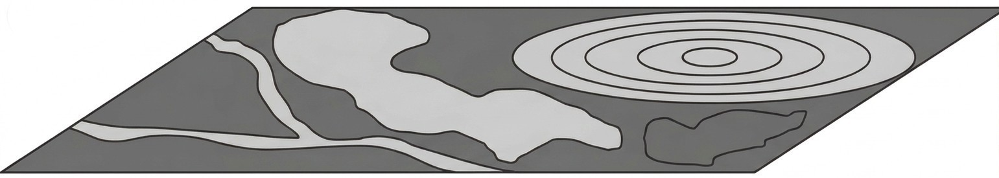
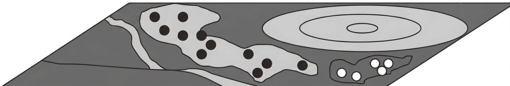
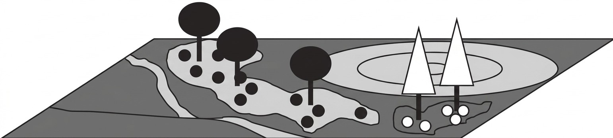
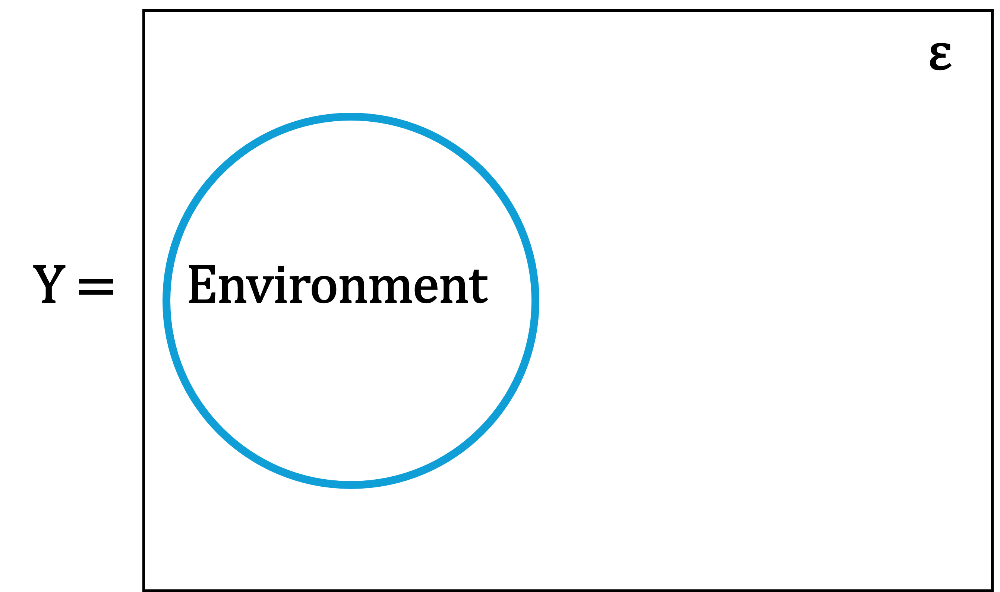
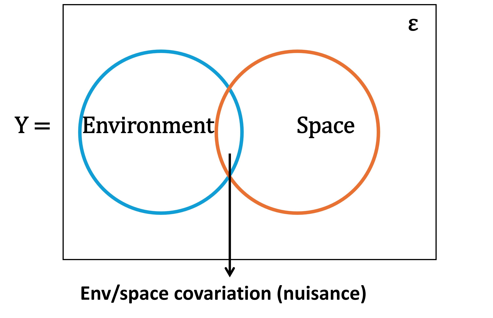



# Where we're going {.center}

## Roadmap for today

1.  Dependence in data due to space
2.  Non-spatial Regression
3.  Space-environment relationship

::: notes
Today we talk about dependence due to space and where it hides. We start to talk about analytical tools, from a common ground, and that is regression
:::

# 1. Spatial structure

## Autocorrelation

> Tobler's First Law of Geography: "Everything is related to everything else, but near things are more related than distant things"

**Autocorrelation** is the relationship between values of a variable with itself according to distance.

{fig-align="center"}

::: notes
Last week we talked about the role of space covered some theoretical foundation for the role of space in ecological studies and touched on the importance of incorporating spatial information.

We talked about Tobler's First Law of Geography... Everything is...

Autocorrelation... Can be positive, or negative For example here: Positive autocorrelation, where darker values are closer together, and negative autocorrelation where dark cells are further apart from one another. CHECKBOARD

The middle plot shows an example pattern with random distribution of values. NO AUTOCORRELATION 
Based on the degree of autocorrelation, in addition to random process, you may get different patterns.
:::

## Processes

**SA-env**: Spatial structure of the environment

**SD**: Spatial dependence of species response to spatially structured environment

**SA-sp**: Spatial autocorrelation of the species

```{r, echo=FALSE, echo=FALSE}
#| autorun: true
#| fig-alt: "Triangle diagram. A node labelled Space sits at the top. Arrows run from Space down-left to Environment, labelled SA-env, and down-right to Species, labelled SA-sp. A third arrow runs from Environment across to Species, labelled SD."
op <- par(mar = c(0, 0, 1, 0))
plot(NA, xlim = c(-1.5, 1.5), ylim = c(-1.0, 1.15),
     asp = 1, axes = FALSE, xlab = "", ylab = "")

nx <- c(0, -1.0, 1.0); ny <- c(0.85, -0.65, -0.65)
nm <- c("Environment", "Space", "Species")
cl <- c("#1D3C34","#70002E", "#1D3C34")

arrows(
       nx[2] + 0.34,
       ny[2] + 0.20,
       nx[1] - 0.14,
       ny[1] - 0.16,
       lwd = 3, length = 0.14, col = "#333333")
arrows(nx[1] + 0.14,
       ny[1] - 0.16,
       nx[3] - 0.34,
       ny[3] + 0.20,
       lwd = 3, length = 0.14, col = "#333333")
arrows(nx[2] + 0.46, 
       ny[2],
       nx[3] - 0.46,
       ny[3],
       lwd = 3, length = 0.14, col = "#333333")


text(-0.74,  0.16, "SA-env", srt = 47,  cex = 0.80, font = 2, col = "#70002E")
text( 0.74,  0.16, "SD",  srt = -47, cex = 0.80, font = 2, col = "#70002E")
text( 0.00, -0.53, "SA-sp",                cex = 0.80, font = 2, col = "#70002E")

for (i in 1:3) {
  rect(nx[i] - 0.45, ny[i] - 0.15, nx[i] + 0.45, ny[i] + 0.15,
       col = "#EFE8D4", border = cl[i], lwd = 3)
  text(nx[i], ny[i], nm[i], font = 2, cex = 0.92, col = "#333333")
}
par(op)
```

::: notes
We learned that different processes may lead to spatial pattern. 
It could be some spatial dependency due to environemental conditions. 

:::

## Spatial structure

{fig-align="center"}

Spatially distributed environmental factors

::: notes


For example, this is a schematic of an environmental variable that is spatially distributed. There are two patches of light and dark grey. There is some sort of structure in the space.
:::

## Spatial structure due to dependence

{fig-align="center"} Spatially distributed seeds due to spatially distributed environmental factors

::: notes
and there are specific plant seeds that grow only on those two patches. light seeds are only on the dark patch, and dark seeds are only on the light patch. So, seeds have spatial dependency on the structure of the env, maybe soil property.
:::

## Spatial structure = Autocorrelation + Dependence

{fig-align="center"}

Spatially distributed seeds due to dispersal processes from the trees and the spatially distributed environmental factor

::: notes
Yet, seeds are coming from trees so what we see in how seeds are distributed in space depends on the tree they dispersed from. The seeds from black trees are closer to the black trees, and conifer seeds are closer to the conifer trees. 

Both seed dispersal and autocorrelation led to the spatial pattern we see. Dispersal is the property of the system under study. Environmental factor is spatially autocorrelated. This is often the case that these two together lead to a spatial pattern and most R packages tell us there is spatial dependency but can't distinguish the origin of spatial pattern whether it's spatial dependency and spatial autocorrelation. Therefore, the study design plays a big role in being able to differentiate the two biotic interaction vs abiotic relationship.
:::

<!--
## Spatial design and analysis

> Spatial configuration of samples, extent, grain and intensity of sampling play a role in the spatial patterns.

```{r, echo=FALSE, echo=FALSE}
#| autorun: true
# Setup blank plot area
plot(c(0, 5),
     c(0, 5),
     type = "n",
     xlab = "Phenomenon",
     ylab = "Sampling",
     xlim = c(0, 5), 
     ylim = c(0, 5),
     axes = FALSE,
     frame.plot = FALSE)

# Add custom solid black axes lines
lines(c(0, 5), c(0, 0), lwd = 2, xpd = TRUE)
lines(c(0, 0), c(0, 5), lwd = 2, xpd = TRUE)

# Draw direct relationship line
lines(c(0, 5), c(0, 5), lwd = 2)

# Add rotated text annotations (srt controls angle)
text(x = 2.5, y = 3, labels = "Analysis", srt = 25, font = 2)
text(x = 3, y = 2.4, labels = "extent, unit size, spacing", srt = 20)

```

::: notes
There are other sources of spatial dependency beyond the organism and its environment and that is us and the way we sample! Our decisions about spatial extent, unit size, spacing of sample locations, resolution all that play a role in the spatial patterns we see.

Questions to expand later lectures: which aspect is affected by each samling choice? precision, point estimate,... Fletcher and Fortin 2019
:::
-->

# 1.2 Simulate non/random locations

## Check your environment

```{r, echo=FALSE}
R.version.string
```

Now confirm plotting works:

```{r, echo=FALSE}
plot(1:10,
     (1:10) ^ 2,
     pch = 19,
     col = "steelblue",
     xlab = "x", 
     ylab = "x squared",
     main = "If you can see this, you're set")
```

::: notes
Trivial on purpose. The goal is that every student sees output in the first two minutes, which massively reduces help-desk traffic later.

The version string printed above is whichever R Quarto used to render, which is worth checking against what your students will be running.
:::

## Locations are data too

Same abundance values, two different spatial arrangements:

```{r, echo=FALSE}
set.seed(42)
n <- 100
pop <- rpois(n, lambda = 8)

# Arrangement A: locations assigned at random
xa <- runif(n, 0, 10)
ya <- runif(n, 0, 10)

# Arrangement B: high counts placed toward the east
xb <- numeric(n)
xb[order(pop)] <- sort(runif(n, 0, 10))
yb <- runif(n, 0, 10)

par(mfrow = c(1, 2), mar = c(4, 4, 3, 1))
plot(xa, 
     ya,
     cex = pop / 4, 
     pch = 19,
     col = "grey40",
     main = "A: random arrangement", 
     xlab = "Easting",
     ylab = "Northing")
plot(xb,
     yb, 
     cex = pop / 4, 
     pch = 19,
     col = "firebrick",
     main = "B: structured arrangement",
     xlab = "Easting",
     ylab = "Northing")
```

::: notes
The punchline: the histogram, mean, variance, and every non-spatial summary of `pop` are IDENTICAL between panels. Only the arrangement differs.

Ask: which panel would a standard GLM of pop on an eastness covariate treat differently? Both give the same answer if you ignore location. That is exactly the failure the course addresses.

Have them run `summary(pop)` to confirm the marginal distribution is untouched.
:::

## Quantifying the difference

For a crude first look, let's correlate the value with its coordinate:

```{r, echo=FALSE}
cor(xa, pop)   # random arrangement
cor(xb, pop)   # structured arrangement
```

::: exercise
Before looking at the second number, guess its sign and rough magnitude from the two maps on the previous slide. Then check yourself.
:::

::: notes
Answers: roughly zero for the random arrangement, strongly positive for the structured one. Both print above.

This only detects a monotonic east–west gradient. It would completely miss patchiness, periodicity, or any pattern without a directional trend. That inadequacy is precisely why correlograms and variograms exist.
:::

# 1.3 Simulate species-environment relationship

## Simulate SA-env

The environment is autocorrelated before any organism responds. Here, we build an spatially autocorrelated environment.

```{r, echo=FALSE}
set.seed(42)
n <- 40
noise <- matrix(rnorm(n * n), n, n)
smooth_field <- function(m, w) {
  out <- m
  for (i in seq_len(nrow(m))) {
    for (j in seq_len(ncol(m))) {
      ri <- max(1, i - w) : min(nrow(m), i + w)
      rj <- max(1, j - w) : min(ncol(m), j + w)
      out[i, j] <- mean(m[ri, rj])
    } #j
  } #i
  out
  }
  
```

> What are the outputs of this code chunk?

::: notes
set.seed(42) — pins the random number generator's state. Every subsequent rnorm() draw becomes reproducible, so you, your students, and the rendered slide all get the identical landscape.

n \<- 40 — the side length of a square grid. You get 40 × 40 = 1,600 cells: big enough to show structure, small enough that R's nested loops below finish instantly.

noise \<- matrix(rnorm(n \* n), n, n) — 1,600 independent draws from a standard normal, poured into a 40 × 40 matrix (column-wise

smooth_field \<- function(m, w) — m is the input matrix; w is the neighborhood radius in cells. The window is square, so an interior cell averages a (2w+1) × (2w+1) block. w = 2 gives a 5 × 5 window, 25 cells.

out \<- m — preallocates the result with the right dimensions and storage mode.

for (i in seq_len(nrow(m))) — rows. seq_len() rather than 1:nrow(m) is deliberate defensive style: on a zero-row matrix, 1:0 returns c(1, 0) and the loop runs anyway, while seq_len(0) correctly returns nothing.
:::

## Range of autocorrelation

Try with different range of autocorrelation: w = 4 first, and then re-run with w = 1 and w = 10.

```{r, echo=FALSE}
#| fig-alt: "Two side-by-side raster images of a 40 by 40 grid. The left image is fine-grained random speckle. The right image shows large smooth patches of similar value."
## w is the smoothing half-width: the range of autocorrelation.
env <- smooth_field(noise, w = 4)
op <- par(mfrow = c(1, 2), mar = c(1, 1, 3, 1))
image(noise,
      col = hcl.colors(24, "YlGnBu"),
      asp = 1, 
      axes = FALSE,
      main = "No autocorrelation", 
      col.main = "#70002E")
image(env, 
      col = hcl.colors(24, "YlGnBu"),
      asp = 1,
      axes = FALSE,
      main = "SA-env", 
      col.main = "#70002E")
par(op)
```

:::: {.hint exercise="ex5"}
::: {.callout-note collapse="true"}
Any positive whole number works. Start with `4`, then change it and re-run — the point of the exercise is the comparison, not the single value.
:::
::::

:::: {.solution exercise="ex5"}
::: {.callout-tip collapse="true"}
```{r, echo=FALSE}
set.seed(42); n <- 40
noise <- matrix(rnorm(n * n), n, n)
smooth_field <- function(m, w) {
  out <- m
  for (i in seq_len(nrow(m))) {
    for (j in seq_len(ncol(m))) {
      ri <- max(1, i - w) : min(nrow(m), i + w)
      rj <- max(1, j - w) : min(ncol(m), j + w)
      out[i, j] <- mean(m[ri, rj])
    }
  }
  out
  }
op <- par(mfrow = c(1, 3), mar = c(1, 1, 3, 1))
for (w in c(1, 4, 10)) {
  image(smooth_field(noise, w),
        col = hcl.colors(24, "YlGnBu"),
        asp = 1,
        axes = FALSE,
        main = paste("w =", w),
        col.main = "#70002E")
}

par(op)
```
:::
::::

::: notes
Insist that students re-run with at least two values of `w`. The single most important idea in Chapter 5 is that autocorrelation has a **range** — a distance beyond which it decays — and `w` is that range made tangible.

Colour note: `hcl.colors()` with "YlGnBu" is perceptually uniform and colourblind-safe, which is why it is used here rather than `rainbow()`. Say so. Students copy whatever palette they first see for the rest of their careers.
:::

## Autocorrelated environment/species
Environment could be spatially structured (**SA-env**) *and* species clusters for endogenous reasons (**SA-sp**). 

```{r, echo=FALSE}
set.seed(7)
n <- 40
smooth_field <- function(m, w) {
  out <- m
  for (i in seq_len(nrow(m))) {
    for (j in seq_len(ncol(m))) {
      ri <- max(1, i - w) : min(nrow(m), i + w)
      rj <- max(1, j - w) : min(ncol(m), j + w)
      out[i, j] <- mean(m[ri, rj])
    }
  }
  out
  }
env    <- smooth_field(matrix(rnorm(n * n), n, n), w = 5)
clump  <- smooth_field(matrix(rnorm(n * n), n, n), w = 3)
```

# 2.1 Regression

## Model schematic

When there is no spatial dependence:

{fig-align="center" width="10%"}

::: notes
How species respond to environemntal variable: quantify relationship

Let's bring in regression. This is a simple schematic to represent regression: Y is our response variable, rectangle is the space of env condition we study and there is some error but we hope that we can explain that response variable with some env variable of interest. There is no spatial dependency, no space really in this schematic.This is ideal case from a regression point of view!
:::

## Model structure

Statistical models describe:

- **Systematic pattern** in a random variable (response), possibly as a function of covariates
- **Random (unexplained) variability** around the mean:

Response = systematic + random

::: callout-note
other pairs of terms: deterministic + stochastic, or mean + dispersion structure of model
:::

:::{.notes}
Broadly, statistical models describe:
:::

## Key elements of a model

::::: columns
::: {.column width="50%"}
Deterministic process:

{style="width: 80%"}
:::

::: {.column width="50%"}
Stochastic process:\
{style="width: 80%"}
:::
:::::

> Why do we need both? Deterministic part is a mathematical model of a process while stochastic part is a statistical model of data that arise from the process.

:::{.notes}
You'll see this model structure throughout the semester.
In the deterministic part, we often have the expected value equals a function of paramters and observations.

In the stochastic part, observations are distributed as a probablistic function of the expected value and uncertainty.
:::

## Basic regression model

*Deterministic process*: What biological process underlies the pattern in my data?

*Stochastic process*: What probabilistic process produces the values of my data?

$$y_i = \beta_0 + \beta_1 x_i + \epsilon_i, \qquad \epsilon_i \sim  {Normal}(0, \sigma^2)$$

is exactly the same as:

$$\mu_i = \beta_0 + \beta_1 x_i, \qquad y_i \sim    {Normal}(\mu_i, \sigma^2)$$

> **What if the errors aren't normal?**

::: notes
While I have you here, what if...
You could use a Poisson, or Binomial distribution, and then use link functions to be able to model the relationship as linear.
:::

## Model assumptions

Linear regression assumes:

- **Linearity** — the relationship between predictors and response is linear
- **Independence** — errors are independent of each other
- **Homoscedasticity** — constant error variance
- **Normality** — residuals are normally distributed

::: callout-note
Assumptions are often violated by real data, but we have tools to detect and address them.
:::

> **Which violation is relevant to spatial analysis?**

::: notes
Linear regression assumes normality of the residuals. ...
:::

## Group membership

Sometimes observations within a group share more in common with each other than with observations from other groups, violating the **independence** assumption.

- Group membership can be modeled as a **random effect**

## Spatial group membership

Observations of one individual animal have more in common compared to observations of other individuals. The grouping of observations could also be spatial:

- Camera deployments deployed as clusters within an array
- Plots nested inside stands, transects nested inside watersheds
- Repeat visits to the same site

Cameras a few hundred metres apart sit in the same stand, see the same individuals, and share whatever we failed to measure. **They are not independent samples of the landscape.**

::: callout-important
Deploying 72 cameras does not buy you 72 independent observations. If they are clustered, the effective sample size is closer to the number of clusters.
:::

# 2.2 Space-environment relationship
## Independent errors

> Spatially independent errors means that there is no spatial autocorrelation neither in the response nor in the environment.

{fig-align="left" width="10%"}

## Friend or foe

When there is spatial dependence, the overlap (covariability) is often a statistical nuisance. But, other times, space might be a parameter in the model.

{fig-align="center" width="50%"}

::: notes
When there is spatial dependence, the overlap can be a statistical nuisance, that's your enemy, you want to get rid of it by accounting for spatial autorelation in the residual of your regression.

Other times, space could be your friend! you would want to include it in your model as a parameter. e.g., you can incorporate xy coordinates, Euclidean distance bet points, least cost path, weight, or connectivity in your model.
:::

# 3.1 Incorporating space

## Spatial models?

Based on friend or foe, there are two general model types referred to as "spatial regression".

(1) Spatial process creates spatial autocorrelation that has to be accounted for. e.g., GLMM, GAMM, Autoregressive models.

(2) Multiple processes play at different spatial scales and we need to partial out spatial variation at all scales.

:::{.notes}
There are a class of models that incoporate space to account for the statistical nuisance. You're interested in how a specific env variable is affecting your response, and spatial autocorrelation is on your way! You would want to get rid of it. Generalized Linear Mixed Models, Generalized Additive Mixed Models, Autoregressive Models are all in this category.
:::


## Example camera trap data

We **simulate** a camera trap survey so we know the truth and can check what each model recovers:

- **12 camera arrays** scattered across a 20 × 20 km landscape
- **6 deployments per array**, each within a few hundred metres of the array centre
- Response: detection rate (detections per 100 trap-nights)
- Covariate: canopy cover at the deployment
- Grouping: `array_id`

## Simulate the camera array

```{r, echo=FALSE}
rm(list = ls())
set.seed(541)

n_array <- 12                       # camera arrays
n_cam   <- 6                        # deployments per array
n       <- n_array * n_cam

# Array centres scattered across a 20 x 20 km landscape
ax <- runif(n_array, 1, 19)
ay <- runif(n_array, 1, 19)

# Deployments sit within ~300 m of their array centre
grp <- rep(seq_len(n_array), each = n_cam)
x   <- ax[grp] + rnorm(n, 0, 0.3)
y   <- ay[grp] + rnorm(n, 0, 0.3)

# Canopy cover varies both among arrays and among deployments within an array
canopy <- rnorm(n_array, 55, 8)[grp] + rnorm(n, 0, 10)
canopy <- pmin(pmax(canopy, 5), 95)

head(data.frame(array = grp,
                x = round(x, 2), 
                y = round(y, 2),
                canopy = round(canopy, 1)),
     8)
```

## Simulate the response

```{r, echo=FALSE}
# ---- true parameter values ----
b0       <- 8.0     # intercept
b1       <- 2.5     # effect of canopy cover
sd_array <- 2.5     # among-array SD  (the random effect)
sd_resid <- 1.2     # among-deployment SD (residual noise)

z_canopy <- as.numeric(scale(canopy))

a    <- rnorm(n_array, 0, sd_array)              # one draw per array
rate <- b0 + b1 * z_canopy + a[grp] + rnorm(n, 0, sd_resid)

cams <- data.frame( array_id = factor(sprintf("A%02d", grp)),
                    cam.id   = sprintf("A%02d-C%d", grp, rep(1:n_cam, n_array)),
                    x = x,
                    y = y,
                    canopy = canopy,
                    z_canopy = z_canopy,
                    rate = rate)
str(cams)
```

The intraclass correlation we built in is $2.5^2 / (2.5^2 + 1.2^2) \approx 0.81$: most of the variation is **among** arrays, not among deployments within them.

## Where the cameras are
Each colour is one array. The six deployments in a cluster are so close together that at this scale they nearly overlap and that is the whole problem.

```{r, echo=FALSE}
array_colors <- hcl.colors(n_array, "Dark 3")
names(array_colors) <- levels(cams$array_id)

plot(y ~ x,
     data = cams,
     col = array_colors[cams$array_id],
     pch = 19, 
     cex = 1.3, 
     asp = 1,
     xlab = "Easting (km)", 
     ylab = "Northing (km)",
     main = "12 arrays, 6 deployments each")
text(ax, ay + 0.9, labels = levels(cams$array_id), cex = 0.7, col = "#333333")
```


## Explore the data

```{r, echo=FALSE}
plot(rate ~ z_canopy,
     data = cams,
     col = array_colors[cams$array_id],
     pch = 19,
     cex = 1.3,
     xlab = "Canopy cover (standardised)",
     ylab = "Detections per 100 trap-nights")
legend("topleft", 
       bty = "n", 
       ncol = 3, 
       cex = 0.7,
       legend = levels(cams$array_id),
       pch = 19, 
       col = array_colors)
```

There is a clear canopy gradient, but the points also separate into coloured bands. 

## How close is too close?

Deployments in the same array are typically under 1 km apart; deployments in different arrays are many kilometres apart. There is no overlap between the two, which is what makes `array_id` a clean grouping variable here.

```{r, echo=FALSE}
d    <- as.matrix(dist(cbind(cams$x, cams$y)))
same <- outer(as.character(cams$array_id), as.character(cams$array_id), "==")
ok   <- upper.tri(d)

round(tapply(d[ok], same[ok], summary)$`TRUE`, 2)   # within-array distances
round(tapply(d[ok], same[ok], median), 2)           # median, by group
```


## The dependence, made visible
If residuals were independent, both boxes would include zero. Same-array pairs are strongly positive: when one camera in a cluster is above the line, its neighbours are too.

```{r, echo=FALSE}
m_naive <- lm(rate ~ z_canopy, data = cams)   # ignores the grouping entirely
r <- residuals(m_naive)

pr <- outer(r, r)                             # product of residual pairs

boxplot(pr[ok] ~ same[ok],
        names = c("Different array", "Same array"),
        col   = c("#DFD1A7", "#70002E"),
        ylab  = "Product of residual pair", xlab = "")
abline(h = 0, lty = 2, lwd = 2, col = "#333333")
```

Correlation is high for deployments under 1km apart and gone beyond that. The range of dependence is the size of a cluster.

<!-- 
## The same thing as a correlogram

```{r, echo=FALSE}
brk <- c(0, 0.5, 1, 2, 4, 8, 12, 16, 25)
cls <- cut(d[ok], brk)
cg  <- tapply(pr[ok], cls, mean) / var(r)

plot(cg ~ I((brk[-1] + brk[-length(brk)]) / 2),
     type = "b",
     pch = 19, 
     lwd = 2, 
     col = "#70002E",
     xlab = "Distance between deployments (km)",
     ylab = "Residual correlation",
     main = "Naive model residuals")
abline(h = 0, lty = 2, lwd = 2, col = "#333333")
```

Correlation is high for deployments under 1 km apart and gone beyond that. The range of dependence is the size of a cluster.
-->

## Fixed effects model: naive

```{r, echo=FALSE}
summary(m_naive)

# The residual SD has swallowed both variance components
round(c(estimated_sigma = summary(m_naive)$sigma,
        truth = sqrt(sd_array^2 + sd_resid^2)), 3)
```

::: callout-warning
The canopy slope is not badly off, but the model has one residual variance where the truth has two. Everything that varies among arrays has been dumped into the noise term, and the residuals are not independent.
:::

## Fixed effects model: array as a factor

```{r, echo=FALSE}
m_fixed <- lm(rate ~ z_canopy + array_id, data = cams)
round(summary(m_fixed)$coefficients[1:3, ], 4)

round(c(residual_sigma = summary(m_fixed)$sigma,
        truth          = sd_resid), 3)

anova(m_naive, m_fixed)
```

::: callout-warning
This recovers the within-array noise correctly, but spends **11 degrees of freedom** on array identity. It gives no estimate of how variable arrays are in general, and it cannot say anything about an array you did not sample.
:::

# 3.2 Mixed effects regression

## Random intercepts model: frequentist

```{r, echo=FALSE}
library(lme4)

my_lmer <- lme4::lmer(rate ~ z_canopy + (1 | array_id), data = cams)
summary(my_lmer)
```


## What is the ICC?

The **intraclass correlation coefficient** splits the leftover variance into its two levels:

$$\text{ICC} = \frac{\sigma^2_a}{\sigma^2_a + \sigma^2_\varepsilon}$$

-   **A variance share.** The fraction of variation, after canopy is accounted for, that is *among* arrays rather than among deployments within an array.
-   **A correlation.** Take two deployments from the same array. The ICC is the correlation between their responses. 

```{r, echo=FALSE}
library(lme4)
v <- as.data.frame(lme4::VarCorr(my_lmer))
v[, c("grp", "vcov", "sdcor")]

icc <- v$vcov[1] / sum(v$vcov)
round(c(var_among_arrays  = v$vcov[1],
        var_within_array  = v$vcov[2],
        ICC               = icc,
        ICC_truth         = sd_array^2 / (sd_array^2 + sd_resid^2)), 3)
```

An ICC near 0 means array membership tells you nothing. Near 1 means the six deployments in a cluster are effectively one observation measured six times.

## Low ICC vs. high ICC

```{r, echo=FALSE}
sim_icc <- function(sd_array,
                    sd_resid = 1.2,
                    n_array = 12, 
                    n_cam = 6,
                    seed = 541) {
  set.seed(seed)
  n   <- n_array * n_cam
  grp <- rep(seq_len(n_array), each = n_cam)
  zc  <- as.numeric(scale(rnorm(n_array, 55, 8)[grp] + rnorm(n, 0, 10)))
  data.frame(
    array.id = factor(sprintf("A%02d", grp)),
    z_canopy = zc,
    rate     = 8 + 2.5 * zc + rnorm(n_array, 0, sd_array)[grp] +
      rnorm(n, 0, sd_resid)
  )
}

par(mfrow = c(1, 2), mar = c(5, 4, 3, 1))

for (s in c(0.4, 4.0)) {
  d   <- sim_icc(sd_array = s)
  r   <- residuals(lm(rate ~ z_canopy, data = d))
  f   <- lme4::lmer(rate ~ z_canopy + (1 | array.id), data = d)
  vv  <- as.data.frame(lme4::VarCorr(f))
  ic  <- vv$vcov[1] / sum(vv$vcov)

  boxplot(r ~ d$array.id,
          col = "#DFD1A7", border = "#333333",
          ylim = c(-12, 12), las = 2, cex.axis = 0.7,
          xlab = "", ylab = "Residual after canopy",
          main = sprintf("SD among arrays = %.1f\nICC = %.2f", s, ic))
  abline(h = 0, lty = 2, lwd = 2, col = "#70002E")
}

par(mfrow = c(1, 1), mar = c(5, 4, 4, 2) + 0.1)
```

Same canopy effect, same sample size, same everything except the among-array SD. On the left the boxes all straddle zero and array identity is nearly irrelevant. On the right whole arrays sit high or low together — that vertical scatter of boxes *is* the ICC.

## What the ICC costs you

For a balanced design with $m$ observations per group, the **design effect** is $1 + (m-1)\cdot\text{ICC}$:

```{r, echo=FALSE}
m    <- n_cam
icc <- with(as.data.frame(lme4::VarCorr(my_lmer)), vcov[1] / sum(vcov))
deff <- 1 + (m - 1) * icc

round(c(ICC           = icc,
        per_array     = m,
        design_effect = deff,
        n_cameras     = n,
        n_effective   = n / deff,
        n_arrays      = n_array), 2)
```

The 72 cameras carry roughly the information of a dozen independent ones close to the number of arrays, not the number of cameras. 

::: callout-important
Two caveats worth remembering.

**The ICC belongs to a model, not to a dataset.** Add a covariate that explains among-array differences and the ICC drops, because variance moves out of $\sigma^2_a$.

**The penalty applies to between-cluster quantities.** For a predictor that varies purely *within* clusters, clustering can help, since each cluster acts as its own control. Canopy varies at both levels here, which is why the naive slope came out about right even though its residual structure was wrong.
:::

:::{.notes}
That is the arithmetic behind the warning on the second slide.
:::

## Did it recover the truth?

```{r, echo=FALSE}
vc <- as.data.frame(lme4::VarCorr(my_lmer))

out <- data.frame(
  parameter = c("intercept", "canopy slope", "SD among arrays", "SD within array"),
  truth     = c(b0, b1, sd_array, sd_resid),
  estimate  = c(lme4::fixef(my_lmer), vc$sdcor)
)
out[, -1] <- round(out[, -1], 3)
out

# Intraclass correlation: share of variance that is among arrays
round(vc$vcov[1] / sum(vc$vcov), 3)
```

One model, both variance components, 3 parameters instead of 13. 

:::{.notes}
The ICC should land near the 0.81 we built in.
:::

## Plot with fixed-effect line

```{r, echo=FALSE}
plot(rate ~ z_canopy, 
     data = cams,
     col = array_colors[cams$array_id],
     pch = 19,
     cex = 1.3,
     xlab = "Canopy cover (standardised)",
     ylab = "Detections per 100 trap-nights")

# Population-level line
abline(lme4::fixef(my_lmer), lwd = 4)

# Array-level lines from the random intercepts 
re <- lme4::ranef(my_lmer)$array_id[, 1]
names(re) <- rownames(lme4::ranef(my_lmer)$array_id)
for (g in levels(cams$array_id)) {
  abline(a = lme4::fixef(my_lmer)[1] + re[g],
         b = lme4::fixef(my_lmer)[2],
         col = array_colors[g], lty = 3, lwd = 2)
}
```

The thick black line is the average array. The dotted lines are the individual arrays, shifted up or down by their random intercept but sharing the same slope.

<!-- 
## Shrinkage

```{r, echo=FALSE}
# Intercept each array would get on its own, vs. the mixed-model estimate
solo <- tapply(residuals(lm(rate ~ z_canopy, data = cams)), cams$array_id, mean)
blup <- re[names(solo)]

plot(solo, blup, pch = 19, col = "#70002E", cex = 1.4,
     xlab = "Array mean residual (no pooling)",
     ylab = "Random intercept (partial pooling)")
abline(0, 1, lty = 2, lwd = 2, col = "#333333")
```

The random intercepts sit slightly inside the 1:1 line: arrays are pulled toward the overall mean. With only six cameras each, a little **shrinkage** guards against over-reading a noisy array.
-->

## Compare the three models

```{r, echo=FALSE}
data.frame(
  model = c("lm, grouping ignored", "lm, array as fixed", "lmer, array as random"),
  canopy_est = round(c(coef(m_naive)[2],
                       coef(m_fixed)[2],
                       lme4::fixef(my_lmer)[2]), 3),
  canopy_se  = round(c(summary(m_naive)$coefficients[2, 2],
                       summary(m_fixed)$coefficients[2, 2],
                       summary(my_lmer)$coefficients[2, 2]), 3),
  params     = c(3, 14, 4),
  residual_sd = round(c(summary(m_naive)$sigma, summary(m_fixed)$sigma,
                        sigma(my_lmer)), 3)
)
cat("truth: canopy =", b1, " residual SD =", sd_resid, "\n")
```

All three get the slope roughly right. They differ in how honestly they describe the noise and how many parameters they burn doing it.

## Random intercepts: Bayesian

```{r, echo=FALSE}
#| cache: true
library(nimble)
library(coda)

list_data <- list(
  rate     = as.numeric(cams$rate),
  n        = nrow(cams),
  array_id = as.numeric(cams$array_id),
  narray   = nlevels(cams$array_id),
  canopy   = as.numeric(cams$z_canopy)
)

inits  <- list(mean_a   = rnorm(1), 
               b_canopy = rnorm(1),
               sd       = rlnorm(1), 
               sd_array = rlnorm(1))
params <- c("mean_a", "b_canopy", "sd", "sd_array")

model_1 <- nimbleCode({
  for (i in 1:n) {
    rate[i] ~ dnorm(mu[i], sd = sd)
    mu[i]   <- a[array_id[i]] + b_canopy * canopy[i]
  }
  for (j in 1:narray) {
    a[j] ~ dnorm(mean_a, sd = sd_array)
  }
  mean_a   ~ dnorm(0, sd = 100)
  sd_array ~ dunif(0, 20)
  b_canopy ~ dnorm(0, sd = 100)
  sd       ~ dunif(0, 100)
})

ni <- 4000; nb <- 2000; nc <- 4; nt <- 1
out <- nimbleMCMC(code      = model_1,
                  constants = list_data,
                  inits     = inits, 
                  monitors  = params,
                  nburnin   = nb, 
                  niter     = ni, 
                  thin      = nt,
                  nchains   = nc,
                  summary   = TRUE,
                  samplesAsCodaMCMC = TRUE)
out$summary$all.chains
```

Compare the posterior means against `b0 = 8`, `b1 = 2.5`, `sd_array = 2.5`, `sd = 1.2`.

## Traceplots

```{r, echo=FALSE}
#| cache: true
coda::traceplot(out$samples)
```

# Your turn

## Practice 1: change the grouping strength

::: {.callout-tip title="Practice 1"}
Re-simulate the survey and watch what the grouping does.

1.  Set `sd_array <- 0`. Refit all three models. Do they still differ?
2.  Set `sd_array <- 6`. What happens to the ICC, and to the naive residual SD?
3.  Set `spread <- 4` so deployments are scattered across the whole landscape instead of clustered. Is `array_id` still a meaningful group?
:::

```{r, echo=FALSE}
set.seed(99)

n_array  <- 12
n_cam    <- 6
sd_array <- 2.5     # <- change me
sd_resid <- 1.2
spread   <- 0.3     # <- deployment scatter around the array centre, km

n   <- n_array * n_cam
grp <- rep(seq_len(n_array), each = n_cam)
ax  <- runif(n_array, 1, 19); ay <- runif(n_array, 1, 19)

d2 <- data.frame(
  array_id = factor(sprintf("A%02d", grp)),
  x = ax[grp] + rnorm(n, 0, spread),
  y = ay[grp] + rnorm(n, 0, spread),
  z_canopy = as.numeric(scale(rnorm(n_array, 55, 8)[grp] + rnorm(n, 0, 10)))
)
d2$rate <- 8 + 2.5 * d2$z_canopy +
  rnorm(n_array, 0, sd_array)[grp] + rnorm(n, 0, sd_resid)

fit <- lme4::lmer(rate ~ z_canopy + (1 | array_id), data = d2)
v   <- as.data.frame(lme4::VarCorr(fit))

round(c(canopy = lme4::fixef(fit)[2],
        sd_array = v$sdcor[1],
        sd_resid = v$sdcor[2],
        ICC = v$vcov[1] / sum(v$vcov)), 3)
```

## Practice 2: random slopes

::: {.callout-tip title="Practice 2"}
So far every array shares one canopy slope. Suppose the canopy effect itself varies among arrays.

1.  Add a random slope to the simulation: draw `b1_j ~ N(2.5, 1)` per array and use `b1_j[grp]` in place of `b1`.
2.  Fit `rate ~ z_canopy + (1 | array_id)` and then `rate ~ z_canopy + (z_canopy | array_id)`.
3.  Compare with `anova()`. Does the random-slope model earn its extra parameters?
4.  Then set the slope SD to 0 and repeat. Does `anova()` correctly tell you the simpler model is enough?
:::

```{r, echo=FALSE}
set.seed(7)

# Your code here

```

## Practice 3: your own data

::: {.callout-tip title="Practice 3"}
Look at a dataset you have collected.

1.  What is the grouping variable? Site, plot, transect, individual, year?
2.  Is it **spatial**? Plot your sampling locations and look for clusters.
3.  Fit the model with and without the random effect and compare the variance components.
:::


<!-- 


## Simulate species response

Now generate species responses to the environment (**SD**) *and* species clusters for endogenous reasons (**SA-sp**), then see whether you can tell them apart from the map.

```{r, echo=FALSE}
set.seed(7)
n <- 40
smooth_field <- function(m, w) {
  out <- m
  for (i in seq_len(nrow(m))) {
    for (j in seq_len(ncol(m))) {
      ri <- max(1, i - w) : min(nrow(m), i + w)
      rj <- max(1, j - w) : min(ncol(m), j + w)
      out[i, j] <- mean(m[ri, rj])
    }
  }
  out
  }
env    <- smooth_field(matrix(rnorm(n * n), n, n), w = 5)
clump  <- smooth_field(matrix(rnorm(n * n), n, n), w = 3)
zs     <- function(m) { (m - mean(m)) / sd(m)  }
```

## Compare species response

The strength of species response to the environment is denoted by `beta`.

```{r, echo=FALSE}
#| fig-alt: "Three raster images of a 40 by 40 grid: the environment layer, the species-driven clumping layer, and the resulting species abundance which visually resembles both."
beta <- 1
gamma <- 1
species <- beta0 + beta * zs(env) + gamma * zs(clump)
op <- par(mfrow = c(1, 3), mar = c(1, 1, 3, 1))
image(env, 
      col = hcl.colors(24, "YlGnBu"),
      asp = 1, 
      axes = FALSE,
      main = "Environment (SA-env)",
      col.main = "#70002E")
image(clump, 
      col = hcl.colors(24, "YlGnBu"), 
      asp = 1,
      axes = FALSE,
      main = "Own clumping (SA-sp)",
      col.main = "#70002E")
image(species, 
      col = hcl.colors(24, "YlGnBu"),
      asp = 1, 
      axes = FALSE,
      main = "What you observe", 
      col.main = "#70002E")
par(op)

cat("Correlation of species with environment:",
    round(cor(as.vector(species), as.vector(env)), 3), "\n")
```

:::: {.hint exercise="ex6"}
::: {.callout-note collapse="true"}
Set `beta` to `1` in the blank and run it. Then change it to `0` and run again and look carefully at whether the third panel still looks patchy.
:::
::::

:::: {.solution exercise="ex6"}
::: {.callout-tip collapse="true"}
With `beta = 1` the species tracks the environment and correlation is moderate.

With `beta = 0` there is **no habitat relationship at all**, and the observed map is still strongly patchy, because SA-sp alone produced it. A patchy map is not evidence of a habitat association.

```{r, echo=FALSE}
set.seed(7); n <- 40
smooth_field <- function(m, w) {
  out <- m
  for (i in seq_len(nrow(m))) {
    for (j in seq_len(ncol(m))) {
    ri <- max(1, i - w) : min(nrow(m), i + w)
    rj <- max(1, j - w) : min(ncol(m), j + w)
    out[i, j] <- mean(m[ri, rj])
    }
  }
  out
}
env   <- smooth_field(matrix(rnorm(n * n), n, n), w = 5)
clump <- smooth_field(matrix(rnorm(n * n), n, n), w = 3)
zs    <- function(m) {
  (m - mean(m)) / sd(m)
}
for (beta in c(0, 1)) {
  sp <- beta * zs(env) + zs(clump)
  cat("beta =",
      beta, 
      " cor(species, env) =",
      round(cor(as.vector(sp), as.vector(env)), 3),
      "\n")
}
```
:::
::::

::: notes
Run `beta = 0` on the projector and let the room sit with the third panel for a few seconds before saying anything. It looks exactly like a species with a habitat association. It has none. The clustering is entirely endogenous — Okubo's result from slide 14, in eight lines of code.

Then the question that opens Chapter 5: *given only that third panel, how would you have known?* The honest answer is that you would not, which is why the rest of Part I exists.
:::

-->

````{=html}
<!--
FOR LATER
## Implicit vs explicit, in code

```{r, echo=FALSE}
# IMPLICIT: a lattice. Only neighbourhood relations exist.
lattice <- matrix(0, nrow = 6, ncol = 6)
lattice[3, 3] <- 1
image(1:6, 
      1:6,
      lattice, 
      col = c("grey92", "firebrick"),
      xlab = "column (j)", 
      ylab = "row (i)",
      main = "Implicit: who is adjacent to whom?")

# Which cells are neighbours of (3,3)? Rook's case:
neighbours <- rbind(c(2,3), c(4,3), c(3,2), c(3,4))
print(neighbours)
```

::: notes
Connect straight back to Figure 1.3. In the implicit representation, "distance" between (3,3) and (5,5) is a count of steps, not a measurement. The model has no access to metres.

Ask what happens if cells are unequal in size or shape — the implicit representation quietly breaks, which is one motivation for going explicit.
:::

## Slide 68 · Exercise 4 — implicit space {#ex4}

Now the left panel of Figure 1.3. In a grid, neighbours are defined by **topology**, not distance. Find the four rook neighbours of cell (3, 3) on a 6 × 6 grid.

```{r, echo=FALSE}
#| caption: Grid topology
i <- 3; j <- 3; n <- 6

nb <- rbind(c(i - 1, j), c(i + 1, j), c(i, j - 1), c(i, j + 1))
colnames(nb) <- c("row", "col")

## Drop any neighbour that falls off the 6 x 6 grid
inside <- nb[, "row"] >= 1 & nb[, "row"] <= n &
          nb[, "col"] >= 1 & nb[, "col"] <= n
nb[inside, ]
```

:::: {.hint exercise="ex4"}
::: {.callout-note collapse="true"}
The grid is `n` cells wide as well as `n` cells tall. The blank should hold the same object used two lines above for the row check.
:::
::::

:::: {.solution exercise="ex4"}
::: {.callout-tip collapse="true"}
```{r, echo=FALSE}
i <- 3; j <- 3; n <- 6
nb <- rbind(c(i - 1, j), c(i + 1, j), c(i, j - 1), c(i, j + 1))
colnames(nb) <- c("row", "col")
inside <- nb[, "row"] >= 1 & nb[, "row"] <= n &
          nb[, "col"] >= 1 & nb[, "col"] <= n
nb[inside, ]

## A corner cell has only two neighbours - edge effects, in two lines of code
i <- 1; j <- 1
nb2 <- rbind(c(i - 1, j), c(i + 1, j), c(i, j - 1), c(i, j + 1))
nb2[nb2[, 1] >= 1 & nb2[, 1] <= n & nb2[, 2] >= 1 & nb2[, 2] <= n, ]
```
:::
::::

::: notes
The second half of the solution is the part worth showing on the projector. A corner cell has two neighbours, an edge cell three, an interior cell four.

That is edge effect, and it is not a nuisance to be programmed around — it is a real property of finite landscapes with real ecological consequences. Every neutral landscape model in Chapter 3 has to decide what to do about it.
:::

## Explicit space and real distances

```{r, echo=FALSE}
# EXPLICIT: patches with coordinates and areas
patches <- data.frame(
  id   = c("A", "B", "C", "D", "E"),
  x    = c(1.0, 3.4, 2.2, 4.6, 1.6),
  y    = c(1.2, 1.0, 3.1, 2.9, 4.0),
  area = c(12, 40, 6, 25, 9)
)

# Full pairwise Euclidean distance matrix
d <- dist(patches[, c("x", "y")])
round(as.matrix(d), 2)
```

::: exercise
Which two patches are closest? Which is most isolated on average? Try `rowMeans(as.matrix(d))`.
:::

::: notes
Which pair is closest? m \<- as.matrix(d); diag(m) \<- NA which(m == min(m, na.rm = TRUE), arr.ind = TRUE)

This tiny distance matrix is the seed of an enormous amount of later material: it's the input to metapopulation connectivity metrics in Chapter 10, and to patch-graph analysis in Chapter 9.

Flag the assumption now: Euclidean distance treats the intervening landscape as uniform. Chapter 9 replaces it with effective or resistance distance. Zeller et al. (2012), one of the Chapter 9 readings, is about how badly we usually estimate that resistance.
:::

## Optional stretch

::: exercise
1.  Modify the arrangement simulation so high abundance clusters in the **centre** rather than the east. Does `cor(x, abundance)` still detect it? Why not?
2.  Add a sixth patch to `patches` and recompute the distance matrix.
3.  Change `lambda` in `rpois()` and note that arrangement and marginal distribution are independent knobs.
:::
-->
````

<!-- # 2.1 Introduction -->

<!-- ## The Fundamental Problem of Scale -->

<!-- - All ecological processes and conservation problems play out across space and time \[3, 184\]. -->

<!-- - **Scale** is not just a methodological detail; it is a fundamental property of ecological systems \[184\]. -->

<!-- - Organisms perceive and interact with their environments at characteristic scales \[184\]. -->

<!-- - Failing to account for scale can lead to incorrect conclusions, resource waste, and failed conservation interventions \[184\]. -->

<!-- ::: notes -->

<!-- Welcome to Chapter 2 on Spatial Scale. Scale is the foundational lens of spatial ecology. This slide introduces the core premise of the chapter: all ecological questions are scale-dependent. As instructors, emphasize that choosing the wrong scale is not just a statistical nuisance but can fundamentally bias our understanding of species-habitat relationships. -->

<!-- ::: -->

<!-- ## Focus of this Chapter -->

<!-- - Define and clarify spatial scale terminology \[184\]. -->

<!-- - Explain why spatial scale is critical for ecological inference \[184\]. -->

<!-- - Introduce multiscale and multilevel quantitative problems \[184\]. -->

<!-- - Demonstrate study design principles for addressing scale \[184\]. -->

<!-- - Walk through practical R exercises using a simulated landscape and a real-world case study of **reptile responses to forest cover in the Southeastern USA** \[184, 190\]. -->

<!-- ::: notes -->

<!-- The chapter is structured in two halves: conceptual foundations followed by hands-on R applications. We'll be using both simulated "toy" landscapes to isolate scale parameters and empirical data on the five-lined skink's response to forest cover across multiple scales. -->

<!-- ::: -->

<!-- # 2.2 Key Concepts and Approaches -->

<!-- ## 2.2.1 Scale Defined and Clarified -->

<!-- - **Scale** is defined by two primary components \[186\]: -->

<!--   - **Grain**: The minimum resolution of the data (e.g., pixel size of a raster or quadrat size) \[186, 188\]. -->

<!--   - **Extent**: The overall size of the study area or the geographic limits of the data \[186\]. -->

<!-- - **Cartographic Scale**: The ratio between distance on a map and real-world distance (e.g., 1:24,000) \[185\]. Note that a "large-scale" map covers a small area in great detail, whereas an "ecological large-scale" refers to large areas \[185\]! -->

<!-- ::: notes -->

<!-- It's vital to clarify the difference between cartographic scale and ecological scale. Cartographers refer to 1:1,000 as large-scale because the fraction is large. Ecologists, however, refer to large scale as broad geographic extents. We must always be precise about whether we mean grain or extent when discussing scale. -->

<!-- ::: -->

<!-- ## Key Scaling Concepts -->

<!-- - **Characteristic Scale**: The scale at which a particular pattern or process is most prominent or best explained \[185\]. -->

<!-- - **Scale of Effect**: The specific scale (combination of grain and extent) at which a species' response to its environment is strongest \[220\]. -->

<!-- - **Cross-Scale Interaction**: Occurs when a process at one scale interacts with a process at another scale (e.g., global climate driving microclimate impacts) \[185\]. -->

<!-- - **Ecological Fallacy**: Inferring individual-level relationships from aggregated group-level data \[185\]. -->

<!-- ::: notes -->

<!-- Be sure to highlight the "Ecological Fallacy". It is a common mistake in spatial analysis where county-level averages are used to make claims about individual animals or pixels. This is a logical error because aggregate patterns do not necessarily reflect individual-level behaviors. -->

<!-- ::: -->

<!-- ## Visualizing Scale Components -->

<!-- - Grain and Extent can be varied independently \[186\]: -->

<!--   - To vary **Extent**, we expand or contract the boundaries of our study \[186\]. -->

<!--   - To vary **Grain**, we coarsen or refine our resolution \[186\]. -->

<!-- ```{r, echo=FALSE} -->

<!-- #| label: fig-scale-concept -->

<!-- #| fig-cap: "Varying Grain vs. Extent in a Spatial Raster" -->

<!-- #| echo: false -->

<!-- #| fig-width: 8 -->

<!-- #| fig-height: 4 -->

<!-- # Base R only -- no real extent/CRS is used here, just random -->

<!-- # noise, so a GIS package is unnecessary. image() needs a -->

<!-- # transpose + column-reversal to match how raster/terra display -->

<!-- # a matrix (row 1 = top of the image). -->

<!-- show_grid <- function(m, main) { -->

<!--   image(t(m)[, nrow(m):1], axes=FALSE, col=heat.colors(100), main=main) -->

<!-- } -->

<!-- par(mfrow=c(1,2), mar=c(1,1,3,1)) -->

<!-- # Fine grain, small extent -->

<!-- show_grid(matrix(runif(100), 10), "Fine Grain / Small Extent") -->

<!-- # Coarse grain, small extent -->

<!-- show_grid(matrix(runif(25), 5), "Coarse Grain / Small Extent") -->

<!-- ``` -->

<!-- ::: notes -->

<!-- This figure illustrates how grain and extent are manipulated. In our R exercises, we will explicitly change both to see how our statistical models respond to these modifications. -->

<!-- ::: -->

<!-- ## 2.2.2 Why Is Spatial Scale Important? -->

<!-- - **Pattern depends on scale**: An organism may appear clumped at a fine scale but randomly or uniformly distributed at a broad scale \[312\]. -->

<!-- - **Relationships are scale-sensitive**: Environmental variables that explain distribution at broad extents (e.g., climate) differ from those at fine grains (e.g., microhabitat) \[184\]. -->

<!-- - **The "Scale of Effect"**: Species do not respond to their environment at an arbitrary pixel size (e.g., 30m Landsat pixel) \[188, 220\]. We must identify the scale at which the species actually experiences the landscape \[220\]. -->

<!-- ::: notes -->

<!-- Point out that species-environment relationships are highly scale-sensitive. For example, temperature might predict a bird's geographic range across the continent (broad scale), but canopy cover might predict its nest location within a forest patch (fine scale). -->

<!-- ::: -->

<!-- ## 2.2.3 Multiscale and Multilevel Quantitative Problems -->

<!-- - **Multiscale Problems**: Varying the grain or extent of the predictor variables to find the scale that best explains species occurrence or abundance \[186, 220\]. -->

<!-- - **Multilevel Problems**: Arise when data are collected in hierarchical structures \[186, 187\]: -->

<!--   - e.g., Point counts nested within transects \[416\], which are nested within forest stands, which are nested within national forests \[416\]. -->

<!--   - Analyzing these nested levels simultaneously requires **hierarchical or multilevel statistical models** (such as mixed-effects models) \[187, 414\]. -->

<!-- ::: notes -->

<!-- Multiscale vs. Multilevel is an important distinction. Multiscale means looking at a single response variable against predictors calculated at different buffer sizes or grains. Multilevel means the data themselves have nested group structures that violate the independence assumption of standard statistics. -->

<!-- ::: -->

<!-- ## 2.2.4 Spatial Scale and Study Design -->

<!-- - Study design must match the scale of the question \[188\]. -->

<!-- - **Grain of analysis**: Often determined by the pixel size of raster layers (e.g., 30m NLCD) \[188, 201\]. If possible, match the pixel grain to the sampling grain (e.g., a 200x100m transect is \~4 ha, so the raster should be aggregated to \~200m grain) \[218\]. -->

<!-- - **Extent of analysis**: Must encompass the full range of environmental gradients of interest \[207\]. -->

<!-- - **Sampling designs**: -->

<!--   - *Random*: Avoids bias but can miss rare habitats \[232\]. -->

<!--   - *Regular*: Evenly covers space, ideal for geostatistics \[232\]. -->

<!--   - *Stratified*: Ensures representation across rare strata \[232\]. -->

<!-- ::: notes -->

<!-- When designing a field study, spatial scale is a primary constraint. If your sampling unit is a point count with a 100m radius, calculating landscape metrics inside a 30m pixel is too fine, while a 10km buffer might be too broad. We need methods to identify the optimal scale of effect. -->

<!-- ::: -->

<!-- # 2.3 Examples in R -->

<!-- ## 2.3.1 Packages in R -->

<!-- - `raster` was historically the primary package for raster manipulation in R \[189\]; `rgdal` handled vector data import (e.g., SpatialPointsDataFrame) \[205\]. Both are now superseded by **`terra`** (raster and vector data in one package), which this chapter's R examples use. -->

<!-- - Other packages include: -->

<!--   - `fields` for distance calculations \[229\]. -->

<!--   - `Matrix` for handling highly efficient sparse matrices \[230\]. -->

<!-- - *Note*: Ensure your spatial layers are in the same Coordinate Reference System (CRS) before running any multiscale extractions \[203\]! -->

<!-- ::: notes -->

<!-- In the practical portion of this chapter, we use the `terra` package extensively (the modern replacement for `raster`/`sp`/`rgdal`). We will aggregate raster layers to change grain, crop them to change extent, and extract cell values within circular buffers to calculate multiscale predictors. -->

<!-- ::: -->

<!-- ## 2.3.2 The Case Study Data -->

<!-- - **Species**: The five-lined skink (*Plestiodon fasciatus*), a common reptile in forested systems \[202, 221\]. -->

<!-- - **Sampling**: Drift fence arrays at 78 forested sites across Alabama, Georgia, and Florida, USA \[190\]. -->

<!-- - **Predictor**: Forest cover derived from the 2011 National Land Cover Database (NLCD) \[201\]. -->

<!-- - **Resolution**: 30m Landsat pixel grain, projected in Albers Equal Area (AEA) \[201, 202, 203\]. -->

<!-- ::: notes -->

<!-- The five-lined skink case study represents a classic wildlife-habitat relationship question. We want to know: at what scale does the surrounding forest cover best predict whether a site is occupied by five-lined skinks? -->

<!-- ::: -->

<!-- ## 2.3.3 A Simple Simulated Example (Toy Landscape) -->

<!-- We start by creating a 6x6 toy landscape to understand raster cell structures and the mathematics of aggregation (changing grain size) \[191, 192\]. -->

<!-- ```{r, echo=FALSE} -->

<!-- #| label: toy-landscape-gen -->

<!-- #| echo: true -->

<!-- library(terra) -->

<!-- set.seed(16) -->

<!-- toy <- rast(ncol=6, nrow=6, xmin=1, xmax=6, ymin=1, ymax=6) -->

<!-- values(toy) <- rpois(ncell(toy), lambda=3) -->

<!-- print(toy) -->

<!-- ``` -->

<!-- ::: notes -->

<!-- Here we simulate a 6x6 raster where values are drawn from a Poisson distribution with a mean (lambda) of 3. This simulates a continuous variable like canopy cover or a count-based index across 36 pixels. -->

<!-- ::: -->

<!-- ## Plotting the Toy Landscape -->

<!-- Let's visualize the toy landscape and inspect the values in each cell \[192\]. -->

<!-- ```{r, echo=FALSE} -->

<!-- #| label: toy-plot -->

<!-- #| echo: true -->

<!-- #| fig-width: 6 -->

<!-- #| fig-height: 5 -->

<!-- #| fig-cap: "Simulated toy landscape used for the scale exercises" -->

<!-- plot(toy, main="Simulated Toy Landscape") -->

<!-- text(toy, digits=2) -->

<!-- ``` -->

<!-- ::: notes -->

<!-- Notice how R populates the raster: it starts from the top-left cell and fills row by row to the bottom-right. -->

<!-- ::: -->

<!-- ## Changing Grain: Aggregation -->

<!-- We can coarsen the grain using the `aggregate` function \[194\]. - **Mean Rule**: Takes the average value of the grouped cells \[194, 195\]. - **Majority Rule (Modal)**: Assigns the most frequent value (useful for categorical data) \[194, 195\]. -->

<!-- ```{r, echo=FALSE} -->

<!-- #| label: aggregate-toy -->

<!-- #| echo: true -->

<!-- # Coarsen grain by a factor of 2 using mean -->

<!-- toy_mean <- aggregate(toy, fact=2, fun=mean) -->

<!-- # Coarsen grain by a factor of 3 using mode (majority) -->

<!-- toy_maj <- aggregate(toy, fact=3, fun="modal")  # terra wants a string name here, not raster's bare modal() object -->

<!-- print(values(toy_mean)) -->

<!-- ``` -->

<!-- ::: notes -->

<!-- When aggregating, we reduce the total number of cells. A factor of 2 means we group 2x2 blocks of cells (4 original cells) into a single larger cell. -->

<!-- ::: -->

<!-- ## Aggregation Effects on Variance -->

<!-- What happens to the mean and variance as we coarsen the grain \[196\]? -->

<!-- ```{r, echo=FALSE} -->

<!-- #| label: aggregate-stats -->

<!-- #| echo: true -->

<!-- cat("Original Mean:", global(toy, mean)[,1], "\n") -->

<!-- cat("Original Variance:", global(toy, var)[,1], "\n\n") -->

<!-- cat("Aggregated Mean (fact=2):", global(toy_mean, mean)[,1], "\n") -->

<!-- cat("Aggregated Variance (fact=2):", global(toy_mean, var)[,1], "\n") -->

<!-- ``` -->

<!-- - **Key Lesson**: Coarsening the grain **preserves the mean** but **drastically reduces the variance** \[196, 197\]! This is due to the spatial averaging of local heterogeneity. -->

<!-- ::: notes -->

<!-- This is a critical mathematical concept: as you coarsen your analysis grain, you smooth out local differences. The mean across the entire extent remains stable, but you lose the extreme high and low values, which reduces the overall spatial variance. -->

<!-- ::: -->

<!-- ## Changing Grain: Disaggregation -->

<!-- We can decrease the grain size (refine resolution) using `disaggregate` \[197\]. - **Simple Disaggregation**: Replicates the value of the parent cell to all sub-cells \[197\]. - **Bilinear Interpolation**: Calculates a distance-weighted average of neighboring pixels \[197\]. -->

<!-- ```{r, echo=FALSE} -->

<!-- #| label: disaggregate-toy -->

<!-- #| echo: true -->

<!-- toy_simple <- disagg(toy, fact=2) -->

<!-- toy_bilinear <- disagg(toy, fact=2, method='bilinear') -->

<!-- ``` -->

<!-- ::: notes -->

<!-- Bilinear interpolation is appropriate for continuous variables (like temperature or elevation) because it creates smooth transitions, but it should never be used for categorical data (such as land-cover classes), where it would produce meaningless intermediate values (e.g., a category of 1.5). -->

<!-- ::: -->

<!-- ## 2.3.4 Multiscale Species Response to Land Cover -->

<!-- Now let's apply these scaling principles to our five-lined skink case study \[201\]. 1. Load the 2011 NLCD raster layer clipped to the Southeast USA \[201, 202\]. 2. Reclassify the NLCD (16 land-cover classes) into a binary **Forest (1) vs. Non-Forest (0)** layer \[204, 208\]. 3. Forest categories in NLCD are Deciduous (41), Evergreen (42), and Mixed Forest (43) \[201, 208\]. -->

<!-- ```{r, echo=FALSE} -->

<!-- #| label: reclass-concept -->

<!-- #| echo: true -->

<!-- #| eval: false -->

<!-- # Simple reclassification approach: -->

<!-- forest <- nlcd -->

<!-- values(forest) <- 0 -->

<!-- forest[nlcd==41 | nlcd==42 | nlcd==43] <- 1 -->

<!-- ``` -->

<!-- ::: notes -->

<!-- For larger datasets, resetting values directly can be slow. In R, using the `classify` function (terra's reclassify) with a lookup matrix is much faster and computationally efficient. -->

<!-- ::: -->

<!-- ## Buffer-Based Multi-Scale Extraction -->

<!-- To calculate forest cover at different scales around our 78 reptile sampling sites, we place circular buffers (e.g., 1km and 5km radii) around each site \[210, 211\]. -->

<!-- ```{r, echo=FALSE} -->

<!-- #| label: buffer-calc-concept -->

<!-- #| echo: true -->

<!-- #| eval: false -->

<!-- # Function to calculate percent forest cover inside a circular buffer -->

<!-- BufferCover <- function(coords, size, landcover, grain){ -->

<!--   bufferarea.i <- pi * size^2 / 10000 # in hectares -->

<!--   coords.i <- terra::vect(cbind(coords[i, 1], coords[i, 2]), type="points") -->

<!--   buffer.i <- terra::buffer(coords.i, width=size) -->

<!--   crop.i <- terra::crop(landcover, buffer.i) -->

<!--   land.buffer <- terra::mask(x=crop.i, mask=buffer.i) -->

<!--   coveramount <- terra::global(land.buffer, 'sum', na.rm=TRUE)[,1] * grain # cell count * cell area -->

<!--   percentcover <- 100 * (coveramount / bufferarea.i) -->

<!--   return(percentcover) -->

<!-- } -->

<!-- ``` -->

<!-- ::: notes -->

<!-- Explain that the loop crops the raster to the circular buffer, masks out cells outside the circle, sums the remaining forest pixels, and calculates the proportion of forest. We repeat this across multiple buffer sizes to construct our scale-dependent predictors. -->

<!-- ::: -->

<!-- ## Correlation of Forest Cover Across Scales -->

<!-- As we increase our buffer size, the values of forest cover become highly correlated across scales \[217\]. -->

<!-- ```{r, echo=FALSE} -->

<!-- #| label: fig-scale-correlation -->

<!-- #| fig-cap: "Correlation of forest cover calculated at different buffer sizes" -->

<!-- #| echo: false -->

<!-- #| fig-width: 5 -->

<!-- #| fig-height: 5 -->

<!-- # Simulated representation of the book's Ch2 correlation plot -->

<!-- set.seed(42) -->

<!-- f1km_sim <- runif(78, 10, 90) -->

<!-- f2km_sim <- f1km_sim + rnorm(78, 0, 8) -->

<!-- f2km_sim[f2km_sim > 100] <- 100; f2km_sim[f2km_sim < 0] <- 0 -->

<!-- plot(f1km_sim, f2km_sim, xlab="Forest Cover (1 km buffer) %", ylab="Forest Cover (2 km buffer) %", pch=19, col="darkgreen", main="High Inter-Scale Correlation") -->

<!-- abline(0, 1, lty=2) -->

<!-- ``` -->

<!-- ::: notes -->

<!-- Because a 2km buffer contains the 1km buffer area inside it, forest cover estimates are highly correlated across adjacent scales. This spatial autocorrelation poses a challenge when trying to identify the exact "characteristic scale" of a species' response. -->

<!-- ::: -->

<!-- ## Identifying the Scale of Effect -->

<!-- We fit separate logistic regression models (GLMs with a binomial link) for the five-lined skink's presence/absence (`pres`) at each scale (500m to 5km buffers) \[222\]. - The scale with the **highest log-likelihood** (or lowest AIC) is identified as the **Scale of Effect** \[222\]. -->

<!-- ```{r, echo=FALSE} -->

<!-- #| label: scale-effect-glm -->

<!-- #| echo: true -->

<!-- #| eval: false -->

<!-- # Example of fitting models at 1 km and 2 km scales -->

<!-- model_1km <- glm(pres ~ f1km, family="binomial", data=flsk) -->

<!-- model_2km <- glm(pres ~ f2km, family="binomial", data=flsk) -->

<!-- logLik(model_1km) -->

<!-- logLik(model_2km) -->

<!-- ``` -->

<!-- - In the five-lined skink dataset, **the 2 km buffer scale** is most supported by the data \[222\]. -->

<!-- ::: notes -->

<!-- By comparing log-likelihoods, we see that the 2km scale provides the strongest statistical fit. However, because of high inter-scale correlation, there is often substantial uncertainty. -->

<!-- ::: -->

<!-- ## Advanced Scale Estimation: Kernel-Based Predictors -->

<!-- - Rather than using simple "hard-bounded" buffers, we can weight landscape variables based on a **Gaussian kernel** \[220, 227\]. -->

<!-- - The weight declines smoothly with distance from the sampling point \[227, 228\]: $$w(d_{ij}) = \exp\left(-\frac{d_{ij}^2}{2\sigma^2}\right)$$ -->

<!-- - $\sigma$ is the scale parameter (bandwidth) determining the kernel's shape \[228\]. -->

<!-- - We can fit this model using the `optim` function to **directly estimate the optimal scale parameter (**$\sigma$) alongside $\alpha$ and $\beta$ \[225, 228\]! -->

<!-- ::: notes -->

<!-- Kernel approaches are biologically superior because they acknowledge that resources right next to a nest have a higher weight than resources 2 kilometers away. Direct estimation using `optim` avoids the arbitrary selection of buffer sizes! -->

<!-- ::: -->

<!-- # 2.4 Next Steps and Advanced Issues -->

<!-- ## Advanced Scale Concepts -->

<!-- - **Characteristic Scale Beyond Species-Environment Relationships**: -->

<!--   - We can identify scales of spatial pattern in the environment itself using geostatistics, semivariograms, and wavelets (discussed in Chapters 5 & 6) \[231\]. -->

<!-- - **Multi-species Scale of Effect**: -->

<!--   - Different species in the same community often respond to their environment at different scales (e.g., highly mobile birds respond at broader scales than small salamanders) \[184, 420\]. -->

<!-- - **Scale and Detection Probability**: -->

<!--   - Scale also influences our ability to detect species during surveys \[204, 259\]. -->

<!-- ::: notes -->

<!-- Highlight that spatial scale is not a one-size-fits-all parameter. Larger, more mobile organisms usually respond to landscapes at much broader scales than smaller, slow-moving organisms. Thus, management of biodiverse landscapes requires multiscale planning. -->

<!-- ::: -->

<!-- # 2.5 Conclusions -->

<!-- ## Summary of Key Takeaways -->

<!-- - **Scale is fundamental**: All patterns and processes are scale-dependent \[3, 184\]. -->

<!-- - **Scale has two axes**: Grain and Extent \[186\]. -->

<!-- - **Coarsening grain preserves the mean but reduces variance** \[196, 197\]. -->

<!-- - **Identify the Scale of Effect** using multiscale model comparisons (hard buffers or distance-weighted kernels) \[220, 222, 227\]. -->

<!-- - **Next step**: Let's apply these scale concepts to slide exercises! -->

<!-- ::: notes -->

<!-- We have covered the core concepts of spatial scale. Now let's move on to the interactive R exercises, where you can modify the aggregation grain and run multiscale logistic regressions directly in your browser! -->

<!-- ::: -->

<!-- # 2.6 Interactive R Exercises (Quarto Live) -->

<!-- ## Exercise 1: Aggregate a Toy Raster and Inspect Variance -->

<!-- ::: {.callout-tip title="Exercise 1"} -->

<!-- Coarsen the grain of a simulated Poisson landscape using different factors and summary functions (`mean` and `modal`). Check how the variance changes \[194, 196\]. -->

<!-- ::: -->

<!-- ```{r, echo=FALSE} -->

<!-- #| label: ex-aggregate -->

<!-- library(terra) -->

<!-- # 1. Create a 10x10 toy landscape -->

<!-- set.seed(42) -->

<!-- r <- rast(ncol=10, nrow=10, xmin=1, xmax=10, ymin=1, ymax=10) -->

<!-- values(r) <- rpois(ncell(r), lambda=4) -->

<!-- # 2. Aggregate by factor of 2 using mean -->

<!-- r_coarse <- aggregate(r, fact=2, fun=mean) -->

<!-- # 3. Print values and compute variance -->

<!-- cat("Original variance:", global(r, var)[,1], "\n") -->

<!-- cat("Coarsened variance:", global(r_coarse, var)[,1], "\n") -->

<!-- # Try changing the aggregation factor below and re-running! -->

<!-- ``` -->

<!-- ::: notes -->

<!-- Encourage students to change `fact=2` to `fact=5` or change `fun=mean` to `fun=modal` and re-run. This will show them visually and numerically how the variance shrinks as grain coarsens. -->

<!-- ::: -->

<!-- ## Exercise 2: Multiscale Logistic Regression for Species Occurrence -->

<!-- ::: {.callout-tip title="Exercise 2"} -->

<!-- Fit logistic regressions at two simulated scales (1km and 5km forest buffers) and identify which scale has a stronger relationship (higher log-likelihood) with species presence \[222, 223\]. -->

<!-- ::: -->

<!-- ```{r, echo=FALSE} -->

<!-- #| label: ex-multiscale-glm -->

<!-- # 1. Create simulated skink occurrence data (78 sites) -->

<!-- set.seed(123) -->

<!-- f1km <- runif(78, 10, 90) -->

<!-- f5km <- f1km + rnorm(78, 0, 15) # higher noise at broader scale -->

<!-- f5km[f5km > 100] <- 100; f5km[f5km < 0] <- 0 -->

<!-- # True relationship is strongest at 1km -->

<!-- lp <- -3 + 0.05 * f1km -->

<!-- p <- plogis(lp) -->

<!-- pres <- rbinom(78, 1, p) -->

<!-- # 2. Fit the GLMs -->

<!-- fit_1km <- glm(pres ~ f1km, family="binomial") -->

<!-- fit_5km <- glm(pres ~ f5km, family="binomial") -->

<!-- # 3. Compare Log-Likelihoods -->

<!-- cat("1 km Model Log-Likelihood:", logLik(fit_1km), "\n") -->

<!-- cat("5 km Model Log-Likelihood:", logLik(fit_5km), "\n") -->

<!-- ``` -->

<!-- ::: notes -->

<!-- In this live exercise, the true relationship was simulated at the 1km scale. Students can verify that the 1km model indeed yields a higher (less negative) log-likelihood than the 5km model, confirming it as the estimated "Scale of Effect". -->

<!-- ::: -->
