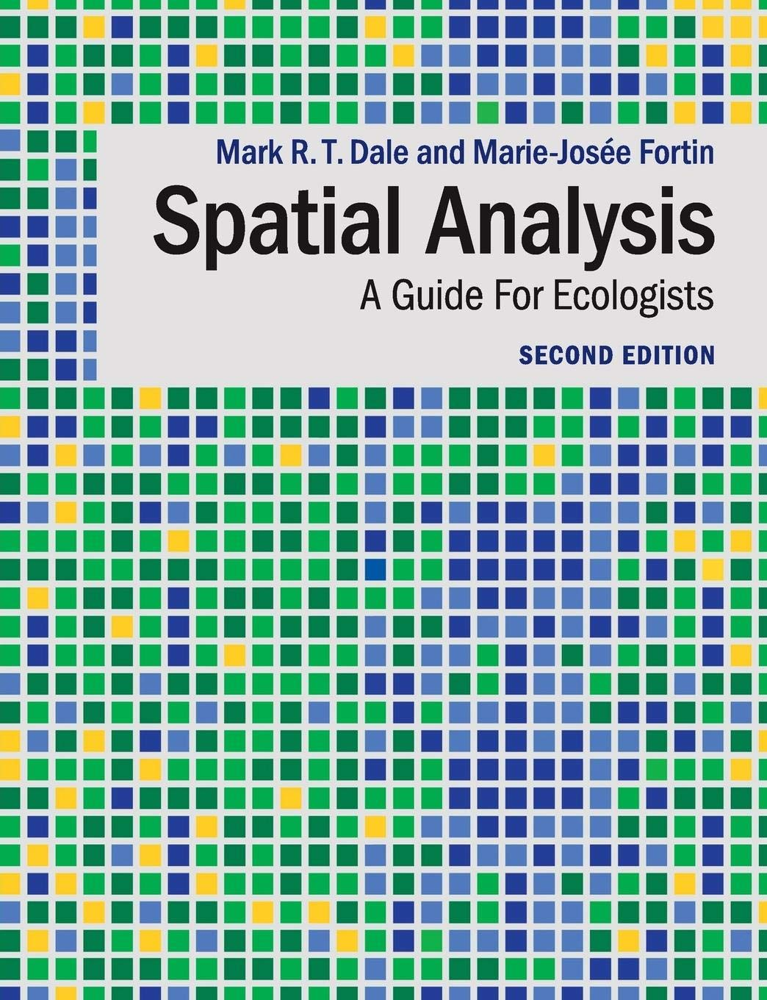



# Where we're going {.center}

## Roadmap for today

1.  Study design choices

2.  Consequence of design on inference

3.  Finding the scale of effect


# 1.1 Study design {.center}

## The design decisions

- Size of the sampling unit (**grain**)
- Type of sampling unit — pixel, patch, or landscape
- Location of sample units — **lag** and sampling strategy
- Size of the study area (**extent**)

Every one of these is a scale decision. Most get made for logistical
reasons.

::: notes
These decision were relevant when you're desining your sampling and
planning fieldwork and protocol. But also, remember, scale of analysis
could be different from the scale of sampling.
:::

## Rule of thumb: grain

- If sample units can easily be aggregated, prefer **smaller** units —
  you can always pool up.

- Make grain **2–5× finer** than the spatial extent of the phenomenon of
  interest.

{fig-align="center"}

::: notes
"You can always pool up" is the practical takeaway: collect fine,
aggregate later. The asymmetry matters because the reverse —
disaggregating — is unreliable, as Lab A will show.

Caveat on the next slide though: finer is not unconditionally better.
:::

## Is finer always better?

Sample units that are **too small** relative to the phenomenon add
**noise**, which creates its own inference problems.

And disaggregating — resampling from coarse to fine — is limited in the
reliable information it can provide at a fine grain.

::: notes
The noise point is real and under-appreciated. If your organism responds
to conditions averaged over a hectare, measuring at 1 m² gives you
10,000 observations of mostly irrelevant variation.

The disaggregation point gets demonstrated concretely in Lab A with
bilinear interpolation, which manufactures smooth, plausible-looking,
entirely invented values.
:::

## Rule of thumb: extent

- Too **small** — not enough variability to identify patterns

- Too **large** — several processes involved, generating patterns at
  multiple scales

- Make extent at least **2–5× greater** than the extent of the
  phenomenon (O'Neill et al. 1996). Some suggest up to **10×** (Jackson
  & Fahrig 2015; Miguet et al. 2016).

::: notes
Note the tension with the "collect fine, pool later" advice: extent has
a real upper bound, because too much extent means mixing processes
rather than just adding data.

The 10× recommendation from Jackson & Fahrig comes directly from finding
that studies systematically truncate at too-small extents and thereby
underestimate scales of effect.
:::

## Study design examples

```{r}
#| echo: false
#| fig-width: 12
#| fig-height: 6.4
#| fig-alt: "Four panels showing alternative study designs. Panel a, patch-scale, shows several irregular habitat patches within one study area, each patch marked as a sample unit. Panel b, landscape-scale, shows two separate landscape blocks each treated as a single sample unit. Panel c, patch-landscape or focal patch, shows one focal patch with a circular buffer drawn around its centroid to summarise the surrounding environment. Panel d, local-landscape, shows a single small pixel as the sample unit with a circular buffer around it."
set.seed(3)
op <- par(mfrow = c(2, 2), mar = c(0.6, 0.6, 2.4, 0.6))

blob <- function(cx, cy, rad, n = 26, col = "grey78") {
  th <- seq(0, 2 * pi, length.out = n)
  rr <- rad * (1 + rnorm(n, 0, 0.16)); rr[n] <- rr[1]
  polygon(cx + rr * cos(th), cy + rr * sin(th),
          col = col, border = "grey35")
}

## (a) patch-scale
plot.new(); plot.window(xlim = c(0, 10), ylim = c(0, 10), asp = 1)
rect(0.2, 0.2, 9.8, 9.8, border = "grey45", lwd = 1.5)
pcx <- c(2.4, 6.9, 4.6, 8.0); pcy <- c(7.4, 7.9, 3.2, 3.0)
for (i in 1:4) blob(pcx[i], pcy[i], 1.35)
points(pcx, pcy, pch = 19, cex = 1.4, col = "firebrick")
title("(a) patch-scale: patch is the unit", cex.main = 1.2)

## (b) landscape-scale
plot.new(); plot.window(xlim = c(0, 10), ylim = c(0, 10), asp = 1)
for (k in 1:2) {
  xo <- c(0.2, 5.4)[k]
  rect(xo, 2.6, xo + 4.4, 7.4, border = "firebrick", lwd = 2.2)
  for (i in 1:3) blob(xo + runif(1, 0.9, 3.5), runif(1, 3.4, 6.6), 0.75)
}
title("(b) landscape-scale: landscape is the unit", cex.main = 1.2)

## (c) patch-landscape / focal patch
plot.new(); plot.window(xlim = c(0, 10), ylim = c(0, 10), asp = 1)
rect(0.2, 0.2, 9.8, 9.8, border = "grey45", lwd = 1.5)
for (i in 1:5) blob(runif(1, 1.5, 8.5), runif(1, 1.5, 8.5), 0.85)
blob(5, 5, 1.5, col = "grey60")
symbols(5, 5, circles = 3.3, inches = FALSE, add = TRUE,
        fg = "firebrick", lwd = 2.2)
points(5, 5, pch = 19, cex = 1.5, col = "firebrick")
title("(c) patch-landscape: focal patch + buffer", cex.main = 1.2)

## (d) local-landscape
plot.new(); plot.window(xlim = c(0, 10), ylim = c(0, 10), asp = 1)
rect(0.2, 0.2, 9.8, 9.8, border = "grey45", lwd = 1.5)
for (i in 1:6) blob(runif(1, 1.5, 8.5), runif(1, 1.5, 8.5), 0.9)
symbols(5, 5, circles = 3.3, inches = FALSE, add = TRUE,
        fg = "firebrick", lwd = 2.2)
rect(4.7, 4.7, 5.3, 5.3, col = "firebrick", border = "firebrick")
title("(d) local-landscape: pixel + buffer", cex.main = 1.2)
par(op)
```

::: notes
Extended from Fahrig (2003). The distinction between (a)/(b) and (c)/(d)
is what Fahrig called patch-scale vs landscape-scale designs.

Design (d) is what Lab B implements, and it's what you want when the
goal is prediction across a region — the pixel is the grain, so
predictions map directly without changing the summary statistic.

Ask which design each student's project uses. Many will realize they're
doing (c) without having named it.

Four panels showing alternative study designs. Panel a, patch-scale,
shows several irregular habitat patches within one study area, each
patch marked as a sample unit. Panel b, landscape-scale, shows two
separate landscape blocks each treated as a single sample unit. Panel c,
patch-landscape or focal patch, shows one focal patch with a circular
buffer drawn around its centroid to summarise the surrounding
environment. Panel d, local-landscape, shows a single small pixel as the
sample unit with a circular buffer around it.
:::

## Unit: pixel, patch, or landscape?

- **Predicting species distributions across regions?** Use the **pixel**
  — it maps directly with no change of summary statistic
- Some questions operate at **patch** scales
- Others operate at **larger** scales — the habitat amount hypothesis

Your research question determines the unit.

::: notes
a lot of times people use pixels because their data are raster, or
patches because they have a patch shapefile.
:::

## Lag and sampling strategy

> The interval or spacing (distance) between sample units

- Should be **smaller** than the average distance between units of the
  phenomenon.

- Sampling considerations: random, regular grid, stratified random,
  cluster sampling

::: notes
refers to distance bet samples. Depending on your study system and the
phenomenon, it is recommended that the the sample spacing should be
smaller than the spacing bet the units of the phenomenon.

There are trade offs between number of sample locations and their
spacing, sometime you prioritize locations spread across the entire
extent with larger spacing, sometimes you may go with a nested design or
cluster sampling where some sample locations are closer to one another,
and there are larger gaps bet clusters. again. depends on your research
questions, parameter of interest and your species.

logistically, cluster sampling is cheaper than regular grids.
:::

<!--
## buffer overlap

When testing scale effects with buffers, should buffers around different
sample locations be allowed to **overlap**?

**Holland et al. (2004); Eigenbrod et al. (2017)** — no; overlapping
landscapes mean non-independent samples

**Zuckerberg et al. (2012)** — that concern is misdirected;
non-independence in the *explanatory* variable isn't the problem.
Non-independence in the **response** is what matters.

::: notes
Zuckerberg et al. have the better of this argument, and the book leans
their way. Regression assumes nothing about independence of predictors —
collinearity costs precision, not validity. The independence assumption
lives in the errors.

But note that overlapping buffers *do* often signal spatially
autocorrelated responses, so the worry isn't baseless, it's
misattributed. That's the setup for Chapters 5 and 6 (Dormann et al.
2007; Beale et al. 2010).

This makes a good 10-minute seminar debate: assign two students each
side.

Overlapping landscapes: a persistent, but misdirected concern when collecting and analyzing ecological data
B Zuckerberg, A Desrochers, WM Hochachka, D Fink, WD Koenig, ...
The Journal of Wildlife Management 76 (5), 1072-1080
:::
-->


## Activity overview

**Format:** small groups of 2–3

**Materials:** Hypothetical studies on the next slide

Your group's job: For each of the four study descriptions, extract
**grain**, **extent**, and **lag**, then decide whether the design is
sound.

::: notes
Preparation:
:::

## Activity

::: activity
> **(A)** We conducted 120 point counts for songbirds, spaced 250 m
> apart, across a 40 × 30 km study area. Habitat was summarized from 30
> m Landsat pixels.
>
> **(B)** We studied habitat selection by a carnivore whose home ranges
> average 50 km². We mapped habitat at 1 km resolution within a 100 km²
> study area.
>
> **(C)** To identify the scale of effect, we measured forest cover in
> buffers of 1, 2, 3, 4, and 5 km around each survey point. Points were
> located 800 m apart.
>
> **(D)** Using county-level data, we found counties with higher mean
> pesticide application have lower mean bee abundance, and conclude that
> farms applying more pesticide support fewer bees.
:::

::: notes
Give pairs 7 minutes to work through all four before revealing the key.
Let them argue about B and C in particular before you say anything.

|   | Grain | Extent | Lag | Verdict |
|---------------|---------------|---------------|---------------|---------------|
| **A** | 30 m (habitat) | 1,200 km² | 250 m | Sound |
| **B** | 1 km² | 100 km² | — | **Extent is 2× the phenomenon.** Recommended 2–5×, some argue up to 10× |
| **C** | — | 1–5 km buffers | 800 m | **Lag is smaller than every buffer radius.** Nested buffers are near-perfectly correlated with each other |
| **D** | County polygon | — | — | **Ecological fallacy** — farm-level inference from county-level aggregates — compounded by MAUP |

the modifiable areal unit problem: aggregated data has a different
property compared to the original raw data, depending on the shape and
scale of aggregated unit.
:::

## Activity debrief

|       | Grain          | Extent         | Lag   | Verdict |
|-------|----------------|----------------|-------|---------|
| **A** | 30 m (habitat) | 1,200 km²      | 250 m |         |
| **B** | 1 km²          | 100 km²        | —     |         |
| **C** | —              | 1–5 km buffers | 800 m |         |
| **D** | County polygon | —              | —     |         |

::: notes
Give pairs 7 minutes to work through all four before revealing the key.
Let them argue about B and C in particular before you say anything.

|   | Grain | Extent | Lag | Verdict |
|---------------|---------------|---------------|---------------|---------------|
| **A** | 30 m (habitat) | 1,200 km² | 250 m | Sound |
| **B** | 1 km² | 100 km² | — | **Extent is 2× the phenomenon.** Recommended 2–5×, some argue up to 10× |
| **C** | — | 1–5 km buffers | 800 m | **Lag is smaller than every buffer radius.** Nested buffers are near-perfectly correlated with each other |
| **D** | County polygon | — | — | **Ecological fallacy** — farm-level inference from county-level aggregates — compounded by MAUP |

the modifiable areal unit problem: aggregated data has a different
property compared to the original raw data, depending on the shape and
scale of aggregated unit.

For C, push past the obvious answer. Holland et al. argue overlapping
landscapes are the problem; Zuckerberg et al. argue non-independence in
the *predictor* is a red herring and only non-independence in the
*response* matters. The real problem in C is worse: forest cover at 1 km
and 5 km will correlate at r \> 0.9, so the log-likelihood surface
across scales is nearly flat and the "best" scale is not identified.
:::

# 1.2 Consequence of design choices

## Activity

Complete the following 5 statements with **↑ increases**, **↓
decreases**, or **→ no change**.

|   | Statement | Answer |
|---------------|------------------------------------------|---------------|
| 1 | Increase grain, hold extent. The **mean** of a continuous layer... |  |
| 2 | Increase grain, hold extent. The **spatial variance**... |  |
| 3 | Increase grain, hold extent. **Rare cover types**... | (disappear first) |
| 4 | Increase grain, hold extent. **Land-cover diversity**... |  |
| 5 | Increase extent, hold grain. **Heterogeneity captured**... |  |

::: notes
1.  **→** 2-4. **↓**
2.  **↑**

Statements 2 and 4 come straight from the chapter's toy raster: mean
held at 3.412 while variance fell from 2.82 to 0.86 under aggregation.
:::

## Why start with simulation?

Simulated data lets you:

- simplify the problem
- work an example where you **know the truth**
- formulate hypotheses
- test methods before applying them to real data

::: notes
with simulation we can set a TRUE scale of effect and ask whether the
method recovers it. That is impossible with the real data, where nobody
knows the answer.
:::

## Custom functions

```{r} 
#| echo: true

#| label: helpers
# --- geometry -------------------------------------------------------------
make_grid <- function(nside, cell) {
  cx <- (seq_len(nside) - 0.5) * cell          # column centres (x)
  cy <- (seq_len(nside) - 0.5) * cell          # row centres (y)
  list(cx = cx, cy = cy)
}

# --- display --------------------------------------------------------------
show_grid <- function(m, cx, cy, main = "", col = terrain.colors(30),
                      labels = FALSE, digits = 2) {
  image(cx, cy, t(m), col = col, main = main, xlab = "", ylab = "", asp = 1)
  if (labels)
    text(rep(cx, each = length(cy)), rep(cy, times = length(cx)),
         labels = format(round(as.vector(m), digits), trim = TRUE), cex = 0.8)
}

# --- change grain ---------------------------------------------------------
block_apply <- function(m, fact, fun) {
  ri <- rep(seq_len(ceiling(nrow(m) / fact)), each = fact, length.out = nrow(m))
  ci <- rep(seq_len(ceiling(ncol(m) / fact)), each = fact, length.out = ncol(m))
  out <- matrix(NA_real_, max(ri), max(ci))
  for (i in seq_len(max(ri)))
    for (j in seq_len(max(ci)))
      out[i, j] <- fun(m[ri == i, ci == j])
  out
}

modal <- function(v) {
  v <- v[!is.na(v)]
  u <- sort(unique(v))
  u[which.max(tabulate(match(v, u)))]          # ties -> lowest value
}

disagg_near <- function(m, fact){
  kronecker(m, matrix(1, fact, fact))
}

disagg_bilin <- function(m, fact) {
  ti <- (seq_len(nrow(m) * fact) - 0.5) / fact + 0.5
  tj <- (seq_len(ncol(m) * fact) - 0.5) / fact + 0.5
  s1 <- apply(m,  2, function(v) approx(seq_len(nrow(m)), v, ti, rule = 2)$y)
  t(  apply(s1, 1, function(v) approx(seq_len(ncol(m)), v, tj, rule = 2)$y))
}

# --- neighbourhood mean (separable box filter) ----------------------------
box_mean <- function(m, w) {
  k <- rep(1 / w, w)
  f <- function(v) as.numeric(stats::filter(v, k, sides = 2))
  t(apply(apply(m, 2, f), 1, f))
}

# --- circle outline, for drawing buffers ----------------------------------
circle <- function(x, y, r, n = 200) {
  a <- seq(0, 2 * pi, length.out = n)
  cbind(x + r * cos(a), y + r * sin(a))
}

"helpers loaded"
```

::: notes
The core idea: `terra` stores a grid, its extent, its resolution, and
its CRS in one object. We are keeping the grid as a plain `matrix` and
the cell-centre coordinates as two vectors, `cx` and `cy`. That is all a
raster is once you drop the CRS.

**Orientation convention, stated once so nobody has to guess later.**
`m[i, j]` is row `i`, column `j`. Column `j` sits at x-coordinate
`cx[j]`; row `i` sits at y-coordinate `cy[i]`. Row 1 is the **south**
edge, not the north. `terra` uses the opposite convention, which is why
its cells fill from the top left and ours do not.

`make_grid` — `(seq_len(nside) - 0.5) * cell` gives cell *centres*, not
edges. For 200 m cells the first centre is at 100 m, the second at 300
m. Using edges here is the classic half-cell offset bug.

`show_grid` — `image()` wants `z[i, j]` to sit at `(x[i], y[j])`, which
is the transpose of our convention, hence `t(m)`. `asp = 1` keeps cells
square. The `text()` call needs the label order to match `as.vector(m)`,
which is column-major with the row index varying fastest — so `cx` is
repeated with `each =` (slow) and `cy` with `times =` (fast). Get those
two backwards and the labels transpose silently.

`block_apply` — the base-R equivalent of `terra::aggregate`. `ri` and
`ci` are group labels: for `nrow = 6, fact = 2` you get `1,1,2,2,3,3`.
The double loop then applies `fun` to each block. `length.out` handles
grids that do not divide evenly, giving a smaller final block rather
than an error.

`modal` — most common value. `sort(unique(v))` then `tabulate` then
`which.max`, which returns the **first** maximum, so ties resolve to the
lowest value deterministically. This matters and comes up two slides on.

`disagg_near` — `kronecker(m, matrix(1, f, f))` replaces each cell with
an `f x f` block of copies. One line, and faster than any loop.

`disagg_bilin` — bilinear interpolation done as two passes of 1-D
`approx`, which is what bilinear *is*. `ti` maps new cell centres into
old row-index space; `rule = 2` clamps at the edges instead of returning
NA.

`box_mean` — a moving-window mean. A 2-D box filter is *separable*: run
a 1-D filter down the columns, then across the rows, and you get the
same answer for a fraction of the work. `sides = 2` centres the window,
which leaves `NA` in a border of width `(w-1)/2` — the same edge
overhang `terra::focal` produces, handled the same way.

`circle` — 200 points around a circle, for `lines()`. We no longer have
`terra::buffer` to draw for us.
:::

## Build a toy landscape

```{r} 
#| echo: true
set.seed(16)
n_toy <- 6
g_toy <- make_grid(n_toy, cell = 1)
toy   <- matrix(rpois(n_toy^2, lambda = 3), n_toy, n_toy)

length(toy)                                    # number of cells
show_grid(toy, g_toy$cx, g_toy$cy, labels = TRUE,
          main = "Toy landscape: Poisson counts")
```

::: notes
set.seed for reproducibility. then generate a lxa landscape 36 cells
drawn from a Poisson with mean 3. Poisson is used because it gives
non-negative numbers, a common format for storing land-cover codes.

you could instead use `rmultinom` to simulate K land-cover types with
specified probabilities — more realistic for categorical cover, but
fiddlier.

**Line by line.** `make_grid(6, cell = 1)` gives six cell centres at
0.5, 1.5, ..., 5.5 on each axis — a 6 x 6 unit landscape.
`matrix(rpois(36, 3), 6, 6)` draws 36 counts and folds them into a 6 x 6
grid; `matrix()` fills **down columns**, on the next slide.
`length(toy)` replaces `ncell()` — for a matrix the number of cells is
just its length. `show_grid(..., labels = TRUE)` prints the value in
each cell, replacing `terra::text()`.
:::

## Check the fill order

Matrices fill **down the first column, then the next** In this case row
1 is the **south** edge:

```{r} 
#| echo: true
toy2 <- matrix(seq_along(toy), n_toy, n_toy)
show_grid(toy2,
          g_toy$cx,
          g_toy$cy,
          labels = TRUE,
          main = "Cell order")
```

::: notes
A tiny habit with a large payoff. Anyone who has silently transposed a
raster knows why.

The general principle worth stating: when you assume something about how
a data structure is organized, spend thirty seconds confirming it. Most
spatial bugs are orientation bugs.

**This slide differs from the book.** `terra` fills from the top left,
left to right, then down. Base R matrices fill top to bottom down the
first column, then move right. Combined with our row-1-is-south
convention, cell 1 lands in the **bottom left** and the numbers climb
*upward* before stepping right. Point at the figure and say so —
students who have used `terra` will expect otherwise, and the mismatch
is the lesson.

**Line by line.** `seq_along(toy)` is `1:36`. `matrix(..., 6, 6)` lays
those out in fill order, so the printed labels *are* the fill order made
visible. This is the base-R equivalent of
`values(toy2) <- 1:ncell(toy2)`.

Worth adding aloud: `as.vector(m)` reverses this, unrolling the matrix
back into fill order. Any time you move between a grid and a vector of
cell values, that is the order you are getting.
:::

## Increasing grain

```{r}
#| echo: true
toy_mean <- block_apply(toy, fact = 2, fun = mean)    # continuous data
toy_maj  <- block_apply(toy, fact = 3, fun = modal)   # categorical data

g2 <- make_grid(nrow(toy_mean), cell = 2)
g3 <- make_grid(nrow(toy_maj),  cell = 3)

op <- par(mfrow = c(1, 3), mar = c(2, 2, 3, 1))
show_grid(toy,      g_toy$cx, g_toy$cy, labels = TRUE, main = "(a) original, 6x6")
show_grid(toy_mean, g2$cx,    g2$cy,    labels = TRUE, main = "(b) mean, fact = 2")
show_grid(toy_maj,  g3$cx,    g3$cy,    labels = TRUE, main = "(c) modal, fact = 3")
par(op)
```

::: notes
Let's aggregate and increase the grain.

`fact = 2` means 2x2 blocks collapse to one cell; `fact = 3` means 3x3.

Which rule to use mean/modal is not a style choice:\
- continuous data (canopy cover) -\> mean\
- categorical data (vegetation type) -\> modal

Using mean on categorical codes produces meaningless numbers — the
average of "deciduous forest" (41) and "shrubland" (52) is not a
land-cover type. Students do this.

**Line by line.** `block_apply(toy, 2, mean)` collapses each 2 x 2 block
to its mean, turning 6 x 6 into 3 x 3. `block_apply(toy, 3, modal)`
collapses each 3 x 3 block to its most common value, giving 2 x 2. The
only thing that changes between the continuous and categorical cases is
the function passed in — worth saying explicitly, because it makes the
choice look like what it is: a decision about the data, not about the
software.

Coarsening the grid means the **cell size grows**, so each aggregated
grid needs its own coordinates: `make_grid(3, cell = 2)` for panel (b),
`make_grid(2, cell = 3)` for panel (c). All three panels still span 0 to
6 units, which is why they can sit side by side. Forgetting to rebuild
the coordinates is the most likely mistake when students adapt this.

`par(mfrow = c(1, 3))` sets three panels; saving the old settings in
`op` and restoring with `par(op)` afterwards keeps later slides from
inheriting the layout.
:::

<!--
## The modal rule has a catch

`modal` is limited when **ties** are common — which happens more often
when aggregating **fewer** cells.

Our helper returns the **lowest** tied value, every time. `terra`'s
default picks one **at random**.

```{r} #| echo: true

#| label: toy-ties
modal(c(1, 1, 2, 2))              # tie between 1 and 2
modal(c(5, 5, 2, 2))              # tie between 2 and 5

# How often is the mode ambiguous when aggregating 2x2 blocks?
tie_rate <- mean(replicate(2000, {
  b <- rpois(4, 3)
  tb <- tabulate(match(b, sort(unique(b))))
  sum(tb == max(tb)) > 1
}))
round(tie_rate, 3)
```

::: notes
A silent random tiebreak means two runs of the same script give
different maps. That's a reproducibility problem hiding inside a
convenience default.

With `fact = 2` you're taking the mode of four values, so ties are
frequent. With `fact = 7`, as in Lab B, much less so.

Practical advice: set the tie rule explicitly, or set a seed, or both.

**We have already taken that advice, which changes the emphasis.** Our
`modal()` uses `which.max()`, which returns the first maximum, and we
sorted the unique values first — so ties always resolve to the lowest
value. That is deterministic and reproducible, and arguably the better
default. But it is still an arbitrary rule, and it introduces a small
systematic pull toward low-numbered classes. For land-cover codes that
means whichever class happens to have the smallest integer wins ties.
Neither default is right; the point is that a default exists and you
should know which one you have.

**Line by line.** The two `modal()` calls are deliberate ties — both
return the smaller value, demonstrating the rule rather than asserting
it. The `replicate()` block estimates how often the tie even arises:
draw four Poisson counts, tabulate them, and check whether more than one
value shares the maximum count. Run it and you will find the mode of
four draws is ambiguous a substantial fraction of the time. That number
is the size of the problem, and it is much larger than students expect.
:::
-->


## Consequence of aggregation

```{r} 
#| echo: true
v_orig <- as.vector(toy)
v_agg  <- as.vector(toy_mean)

round(c(mean_original   = mean(v_orig),
        mean_aggregated = mean(v_agg)), 3)

round(c(var_original    = var(v_orig),
        var_aggregated  = var(v_agg)), 3)
```

The mean is **preserved**. The variance **collapses**.

::: notes
The book reports mean 3.412 unchanged and variance falling from 2.82 to
0.86 — roughly a threefold drop from a single 2x2 aggregation.

Make them predict before revealing. Most correctly guess the mean is
preserved. Almost nobody anticipates how severe the variance loss is.

Then the consequence: if your response depends on environmental variance
rather than environmental mean, coarsening your grain can erase your
effect entirely.

**Line by line.** `as.vector()` unrolls a matrix into its cell values in
fill order — the base-R equivalent of `values()`.

Why the mean survives and the variance does not? The mean of blockmeans
equals the overall mean whenever the blocks are equal-sized, so
aggregation is exactly mean-preserving here. The variance falls because
averaging four draws cuts their variance by a factor of four — the
within-block variation is not summarised, it is **deleted**.

Our numbers will not match the book's 2.82 and 0.86 exactly. Same seed,
but `rpois` is being called on a different grid construction, so the
draws differ. The *pattern* — mean unchanged, variance down roughly
threefold — is what to point at.
:::

## Decreasing grain

```{r} 
#| echo: true
toy_dis <- disagg_near(toy,  fact = 2)          # replicate values
toy_bil <- disagg_bilin(toy, fact = 2)          # interpolate

gd <- make_grid(nrow(toy_dis), cell = 0.5)

op <- par(mfrow = c(1, 3), mar = c(2, 2, 3, 1))
show_grid(toy,     g_toy$cx, g_toy$cy, main = "(a) original")
show_grid(toy_dis, gd$cx,    gd$cy,    main = "(b) disagg, nearest")
show_grid(toy_bil, gd$cx,    gd$cy,    main = "(c) disagg, bilinear")
par(op)
```

::: notes
The book's Figure 2.6. Panel (c) is the teaching moment: bilinear
interpolation produces a smooth, attractive, high-resolution surface
containing **no information that wasn't in panel (a)**.

It has manufactured plausible detail. That detail will happily enter a
model and produce standard errors that look great.

Bilinear is defensible for genuinely continuous surfaces (elevation,
temperature). It is indefensible for land-cover categories —
interpolating between codes 41 and 52 gives you 46.5, which is nothing.

Ask: when is fabricated smoothness acceptable? Answer: when you have
external reason to believe the underlying surface really is smooth.

**Line by line.** `disagg_near` uses `kronecker()` to replace each cell
with a 2 x 2 block of identical copies — 6 x 6 becomes 12 x 12 with no
new information, and panel (b) looks blocky because it *is*.

`disagg_bilin` runs `approx()` down the columns and then across the
rows. Writing bilinear interpolation as two 1-D passes is not a
shortcut; it is the definition. Worth showing on the board if you have
time, because students often treat "bilinear" as a black box.

Cells are now half the original size, so `make_grid(12, cell = 0.5)`
rebuilds the coordinates. Both new panels still span 0 to 6.

No labels on these panels — 144 numbers is unreadable. The point is the
texture, not the values.
:::

## Changing extent

```{r} 
#| echo: true
# shrink: keep the cells whose centres fall inside x,y in [2, 4]
jc <- which(g_toy$cx >= 2 & g_toy$cx <= 4)
ic <- which(g_toy$cy >= 2 & g_toy$cy <= 4)
toy_crop <- toy[ic, jc, drop = FALSE]
gc_ <- list(cx = g_toy$cx[jc], cy = g_toy$cy[ic])

# grow: pad one ring of NA on every side
toy_big <- matrix(NA_real_, n_toy + 2, n_toy + 2)
toy_big[2:(n_toy + 1), 2:(n_toy + 1)] <- toy
gb <- list(cx = c(-0.5, g_toy$cx, 6.5), cy = c(-0.5, g_toy$cy, 6.5))

c(cropped = length(toy_crop), extended = length(toy_big),
  new_NA = sum(is.na(toy_big)))

op <- par(mfrow = c(1, 2), mar = c(2, 2, 3, 1))
show_grid(toy_crop, gc_$cx, gc_$cy, labels = TRUE, main = "crop: smaller extent")
show_grid(toy_big,  gb$cx,  gb$cy,  labels = TRUE, main = "extend: larger, empty")
par(op)
```

Growing the extent adds **NA**, not data.

::: notes
The asymmetry is the point. Cropping discards information; extending
manufactures empty space.

Increasing extent is not helpful unless you also populate the new area
with data. Obvious when stated, and yet "extend then fill with zeros" is
a real and damaging move — zero forest cover is a claim, not a
placeholder.

Ask what the right fill is for an unsampled region. Usually NA, and then
your model has to handle missingness honestly.

**Line by line.** Cropping is matrix subsetting.
`which(cx >= 2 & cx <= 4)` finds the **columns** whose centres fall in
the x-range, and the same on `cy` for rows; `toy[ic, jc]` keeps that
block. `drop = FALSE` stops R from collapsing a single row or column to
a vector — a real hazard if someone crops to a thin strip. Note that
selecting by cell *centre* is a choice: a cell straddling the boundary
is either in or out, never partial, which is the same convention
`terra::crop` uses.

Extending is padding. Build a matrix of `NA` two cells larger in each
direction, then write the original into the middle. The coordinate
vectors need the new centres prepended and appended, hence
`c(-0.5, cx, 6.5)`.

The printed `new_NA` count is the argument in one number: extending
added 28 cells and zero observations. Ask what would happen if you
replaced `NA_real_` with `0` — the grid looks complete, nothing errors,
and every buffer overlapping the edge now reports less forest than it
should.
:::

# 1.3 Simulations

## A landscape with realistic clumping

```{r} 
#| echo: true
set.seed(2024)
cell_m <- 200                      # 200 m cells, matching sampling grain
nside  <- 300                      # 300 x 300 cells = 60 x 60 km
g      <- make_grid(nside, cell_m)

r <- matrix(rnorm(nside^2), nside, nside)

# two smoothing passes create spatially autocorrelated structure
r <- box_mean(r, 11)
r <- ifelse(is.na(r), mean(r, na.rm = TRUE), r)   # refill the edge overhang
r <- box_mean(r, 11)
r <- ifelse(is.na(r), mean(r, na.rm = TRUE), r)

# threshold to roughly 45% forest
thr    <- quantile(as.vector(r), 0.55)
forest <- ifelse(r > thr, 1, 0)

mean(forest)                       # proportion forest
show_grid(forest, g$cx, g$cy, col = c("grey92", "forestgreen"),
          main = "Simulated binary forest cover (green = forest)")
```

::: notes
White noise smoothed twice, then thresholded. Crude but it produces the
property that matters: forest is CLUMPED, so cover measured at nested
radii will be correlated across scales — which is the whole difficulty
of this chapter.

Pure white noise would not work. Cover in a 1 km and a 5 km buffer
around the same point would be nearly uncorrelated, the scale of effect
would be trivially identifiable, and the lesson would be lost.

Chapter 3 covers neutral landscape models, which do this properly.

**Line by line.** `matrix(rnorm(nside^2), nside, nside)` is 90,000
independent standard normals — pure white noise, zero spatial structure.

`box_mean(r, 11)` averages each cell with its 11 x 11 neighbourhood.
That single operation is what creates the autocorrelation: adjacent
output cells share 110 of their 121 input cells, so they cannot differ
much. Running it **twice** roughly doubles the effective range of
clumping. Change 11 to 5 or 31 and re-run to show the grain of the
landscape change — it is the most instructive knob on the slide.

The `ifelse(is.na(...))` line after each pass matters and is easy to
miss. A centred 11-wide window cannot be computed within 5 cells of the
edge, so those cells come back `NA`. Filling with the overall mean is
crude but keeps the border usable. It must be done **after each pass**,
not once at the end — otherwise the second pass propagates the NA border
five cells further inward.

`quantile(as.vector(r), 0.55)` finds the value with 55% of cells below
it; `ifelse(r > thr, 1, 0)` marks the top 45% as forest. Thresholding a
smooth surface is what turns a continuous gradient into patches. Because
we set the quantile directly, `mean(forest)` comes out at 0.45 by
construction — say that out loud so nobody thinks it is a happy
accident.
:::

## Place the sample sites

```{r}
#| echo: true
set.seed(11)
n_sites <- 78
margin  <- 6000                    # keep 5 km buffers inside the map
extent_m <- nside * cell_m

sites <- data.frame(
  site = sprintf("S%02d", seq_len(n_sites)),
  x    = runif(n_sites, margin, extent_m - margin),
  y    = runif(n_sites, margin, extent_m - margin)
)

show_grid(forest, g$cx, g$cy, col = c("grey92", "forestgreen"),
          main = "78 sites on the simulated landscape")
points(sites$x, sites$y, pch = 19, cex = 0.8)
head(sites, 3)
```

::: notes
The margin matters: a 5 km buffer centred within 5 km of the edge would
be clipped, and the cover estimate silently biased by the missing area.
Real studies hit this constantly and often ignore it.

Ask what to do when real sites ARE near the edge of your map. Options:
get more map, drop the sites, or correct for clipped buffer area.
Quietly doing none of these is the common choice.

**Line by line.** `extent_m` is 60,000 m. `runif(78, 6000, 54000)`
scatters sites uniformly in the interior, holding every site at least 6
km from an edge — 5 km for the largest buffer plus a kilometre of slack.

`points()` works directly after `show_grid()` because `image()` sets up
ordinary plot coordinates in map units. This is the one real convenience
of dropping `terra`: there is no `SpatVector` to construct, sites stay a
plain data frame with `x` and `y` columns, and every base graphics
function just works on them.

Worth connecting to the previous slide: because the landscape was built
by smoothing, the edge cells were filled with the global mean and are
therefore *less* variable than the interior. The 6 km margin keeps
buffers away from that artefact too, not just off the edge of the grid.
:::

## Forest cover inside a buffer, one site

```{r}
#| echo: true
x0 <- sites$x[1]; y0 <- sites$y[1]

# (a) local view: crop to the 5 km buffer's bounding box, padded 2 km
pad <- 2000
jv  <- which(abs(g$cx - x0) <= 5000 + pad)
iv  <- which(abs(g$cy - y0) <= 5000 + pad)

op <- par(mfrow = c(1, 2), mar = c(2, 2, 3, 1))
show_grid(forest[iv, jv], g$cx[jv], g$cy[iv], col = c("grey92", "forestgreen"),
          main = "(a) buffers around site S01")
lines(circle(x0, y0, 5000), col = "firebrick", lwd = 3)
lines(circle(x0, y0, 1000), col = "firebrick", lwd = 3)
points(x0, y0, pch = 19, cex = 1.4)

# (b) crop to the 1 km box, then mask everything outside the circle to NA
j1 <- which(abs(g$cx - x0) <= 1000)
i1 <- which(abs(g$cy - y0) <= 1000)
in_1km <- forest[i1, j1, drop = FALSE]
dx <- rep(g$cx[j1] - x0, each = length(i1))
dy <- rep(g$cy[i1] - y0, times = length(j1))
in_1km[dx^2 + dy^2 > 1000^2] <- NA

show_grid(in_1km, g$cx[j1], g$cy[i1], col = c("grey92", "forestgreen"),
          main = "(b) forest within 1 km, masked")
lines(circle(x0, y0, 1000), col = "firebrick", lwd = 3)
par(op)
```

::: notes
This is the book's Figure 2.8 in two panels: isolate the habitat, place
a buffer, count the cells, multiply by cell area.

The `crop` then `mask` idiom is worth naming explicitly. `crop` reduces
the extent to the buffer's bounding box — a rectangle. `mask` sets
everything outside the actual circle to NA. Crop alone leaves you with
the corners of the box, which would inflate your cover estimate.

Students forget the mask. The result looks fine and is wrong.

**The idiom survives the rewrite, which is the good news.** Panel (b)
does crop and mask in five lines of base R and the lesson is unchanged —
arguably clearer, because both steps are now visible rather than hidden
inside two function calls.

**Line by line.** The crop is `which(abs(cx - x0) <= 1000)` for columns
and the same on `cy` for rows: keep every cell centre within 1 km on
each axis. That is a **square**, not a circle, and is exactly what
`terra::crop` gives you.

The mask is the next three lines. `dx` and `dy` hold each selected
cell's offset from the site. The ordering is the trap: `as.vector()` of
a matrix runs down columns with the row index varying fastest, so `dy`
uses `times =` (cycles fast, once per row) and `dx` uses `each =`
(repeats slowly, once per column). Reverse them and the mask silently
rotates. Then `in_1km[dx^2 + dy^2 > 1000^2] <- NA` blanks everything
outside the circle. Comparing squared distances avoids 2,601 square
roots.

`show_grid` renders `NA` cells as blank, so the masked corners simply
disappear — the same visual as `terra`.

`lines(circle(...))` replaces `lines(buffer(pt, width))`. We are drawing
the circle rather than asking a geometry library to construct it.

One genuine improvement to mention: our mask is an **exact** circle,
tested cell by cell. `terra::buffer` approximates the circle with a
polygon, so its cover figures are very slightly off. It does not matter
here, but it is the kind of thing that matters when you need areas.
:::

## Turn that into a function

```{r} 
#| echo: true
buffer_cover <- function(x, y, size, m, cx, cy) {
  j <- which(abs(cx - x) <= size)              # crop: columns in range
  i <- which(abs(cy - y) <= size)              # crop: rows in range
  sub <- m[i, j, drop = FALSE]

  dx <- rep(cx[j] - x, each  = length(i))      # x offset, varies slowly
  dy <- rep(cy[i] - y, times = length(j))      # y offset, varies fast
  inside <- dx^2 + dy^2 <= size^2              # mask: exact circle

  100 * mean(sub[inside], na.rm = TRUE)        # percent cover
}

buffer_cover(sites$x[1], sites$y[1], size = 1000,
             m = forest, cx = g$cx, cy = g$cy)
```

::: notes
Compare to the book's `BufferCover`, which had a bug: it referenced
`coords[i, 1]` using an `i` from the enclosing loop rather than taking
an index argument. It worked only because `i` happened to exist
globally. This version takes x and y directly.

The book also had a copy-paste error in the loop that follows — both
lines assigned to `f1km`, so `f2km` was never filled. Worth showing
students as a reminder that published code carries bugs and that a
for-loop with repeated lines is where they hide.

**This version is simpler than either the book's or the terra one, and
worth dwelling on.** The book computed cell area in hectares, buffer
area in hectares, summed the forest cells, multiplied, divided, and
multiplied by 100. All of that cancels. For a **binary** layer where 1
is forest, the mean of the cells inside the circle *is* the proportion
of forest, so `100 * mean(...)` is the whole calculation. Ask the class
why before telling them — it is a good five-second question and it
exposes whether they understand what the layer holds.

Two consequences worth stating. First, this only works because the layer
is 0/1. If `m` held land-cover codes you would need
`mean(sub[inside] %in% c(41, 42, 43))`. Second, because we take a mean
rather than a sum, the result is automatically correct even when the
circle is clipped by the map edge — the denominator shrinks with the
numerator. The book's version, which divides by the full analytical
buffer area `pi * size^2`, silently under-reports for clipped buffers.
That is a real improvement, not just a simplification.

**Line by line.** The two `which()` calls are the crop and reduce work
enormously: for a 5 km buffer on a 200 m grid we examine roughly 51 x 51
= 2,601 cells instead of all 90,000. The `dx`/`dy`/`inside` lines are
the mask, with the same `each` versus `times` ordering trap as the
previous slide. `na.rm = TRUE` handles cells masked out earlier or lost
to the edge.

The function takes `cx` and `cy` explicitly rather than reaching for `g`
in the global environment. That is the discipline the book's bug was
missing.
:::

## Cover at six scales, all sites

```{r}
#| echo: true
scales <- c(500, 1000, 2000, 3000, 4000, 5000)

cover <- sapply(scales, function(s)
  mapply(buffer_cover, sites$x, sites$y,
         MoreArgs = list(size = s, m = forest, cx = g$cx, cy = g$cy)))
colnames(cover) <- paste0("f", scales)

dim(cover)
round(head(cover, 4), 1)
```

::: notes
468 buffer operations (78 sites x 6 scales). With the bounding-box crop
inside `buffer_cover` this is now fast — it was the slowest chunk in the
deck under `terra`.

`sapply` over scales with `mapply` over sites replaces the book's nested
for-loop and sidesteps the indexing bug two slides back.

**Line by line.** `mapply` walks `sites$x` and `sites$y` in parallel,
calling `buffer_cover` once per site; `MoreArgs` supplies the arguments
that stay fixed across sites. `sapply` wraps that over the six scales
and binds the results into a 78 x 6 matrix — sites down the rows, scales
across the columns. `dim(cover)` confirms the shape, which is worth
printing because everything downstream indexes it as `cover[, "f2000"]`.

Why this is fast now: each call crops to the buffer's bounding box
before computing any distances, so a 500 m buffer touches about 36 cells
rather than 90,000. Total work is roughly 700,000 distance calculations
instead of 42 million.

If you switch to the real 30 m NLCD data, aggregate first — the book
warns that computation time grows with buffer size, and at 30 m a 5 km
buffer contains about 87,000 cells before you have done anything.
:::

## The problem: cover is correlated across scales

```{r}
#| echo: true

pairs(cover, pch = 19, cex = 0.45, col = "grey30",
      gap = 0.25, cex.labels = 1.3,
      labels = paste0(scales / 1000, " km"))
```

```{r} 
#| echo: true

round(cor(cover), 2)
```

::: notes
The book's Figure 2.9. Every pairwise scatterplot is tight and positive,
and the correlation matrix confirms it — adjacent scales above 0.9, and
even 500 m vs 5 km substantially correlated.

Why: a 5 km buffer CONTAINS the 1 km buffer. These are not independent
measurements, they are nested ones.

This is the crux of the chapter. Everything on the next four slides is a
consequence of this figure.

**Line by line.** Nothing changed here — `cover` is an ordinary numeric
matrix either way, so `pairs()` and `cor()` need no adaptation. Point
that out: once the raster work has produced a site-by-covariate table,
you are doing plain statistics and the spatial packages are irrelevant.

`labels = paste0(scales / 1000, " km")` relabels the diagonal in
kilometres so the panel headings read "0.5 km" rather than "f500".

Two things to draw attention to in the correlation matrix. The values
just off the diagonal are the highest, because 3 km and 4 km buffers
overlap almost completely. And the whole matrix is positive — there is
no scale at which cover becomes uninformative about cover at another
scale, which is precisely why the next slide's model comparison is
underpowered.
:::

## Why that correlation is the whole problem

If forest cover at 1 km, 2 km, and 5 km are correlated at *r* \> 0.9,
then models using them will fit **almost equally well**.

"The scale of effect" is then only weakly identifiable from the data.

We can still say forest cover matters. Saying *at what scale* is much
harder.

::: notes
Make sure this lands before showing the log-likelihood profile, or
students will over-read the peak.

The analogy: this is collinearity, and the usual collinearity
consequences apply — coefficients are estimable but poorly separated,
and model comparison between near-identical predictors is low-powered.

Tie back to Jackson & Fahrig (2015): if the data barely distinguish
scales, the reported scale of effect will be driven by which scales the
analyst chose to test. Their meta-analytic result is exactly what this
figure predicts.
:::

## Simulate presence with a KNOWN scale of effect

```{r} 
#| echo: true

# occurrence responds to forest cover at 2 km.
set.seed(7)
true_scale <- "f2000"
p_occ <- plogis(-6.16 + 0.0856 * cover[, true_scale])
pres  <- rbinom(n_sites, size = 1, prob = p_occ)

table(presence = pres)
round(range(p_occ), 3)
```

Now we know the answer is **2 km**. Can the standard method find it?

::: notes
This is what simulation buys us and the real data cannot. The book fits
its models and reports that 2 km is best supported, but nobody knows the
skink's true scale of response, so there's no way to evaluate the
method.

Using the book's own estimates (-6.16, 0.0856) means our simulated
dataset has a comparable prevalence and effect size, so the figures look
like Fig 2.11.

Ask students to predict now: will the log-likelihood peak at exactly 2
km? Take a show of hands, then reveal.

**Line by line.** `cover[, "f2000"]` pulls the 2 km column — percent
cover, on a 0 to 100 scale, which is why the coefficient 0.0856 is
small. `plogis()` is the inverse logit, converting the linear predictor
to a probability between 0 and 1. `rbinom(78, size = 1, prob = p_occ)`
draws one Bernoulli trial per site with that site's own probability,
giving the 0/1 presence vector.

Only `f2000` appears anywhere in this chunk. The other five columns
exist in `cover` but play no causal role — that is what makes 2 km the
truth rather than a label.

The added `range(p_occ)` line is worth printing: if the probabilities
span most of 0 to 1 the design has real signal, whereas a narrow range
would mean even a perfect method could not distinguish scales. Check it
before drawing conclusions from the next three slides.

`table(presence = pres)` reports prevalence. If it comes out badly
lopsided, re-seeding is legitimate — but say so out loud rather than
quietly.
:::

## Logistic regression at one scale

$$\text{logit}(p_i) = \alpha + \beta \times \text{forest}_i$$

```{r} 
#| echo: true

m2km <- glm(pres ~ cover[, "f2000"], family = binomial)
round(summary(m2km)$coefficients, 4)
logLik(m2km)
```

::: notes
Standard logistic regression, the same model as the book's Equation 2.1.
Errors assumed binomial.

Be explicit about what this model ignores, as the book is: no detection
error (MacKenzie et al. 2002), no spatial dependence (Chapters 5-6), no
other covariates. It is a teaching model, not a publishable one.

The detection point is worth a minute for a wildlife audience — a naive
occurrence model conflates "absent" with "present but not detected," and
the whole occupancy-modelling literature exists because of it.

**Line by line.** Unchanged from the book, and unaffected by dropping
`terra` — `cover` is a matrix and `pres` a vector, so this is ordinary
`glm`. `family = binomial` selects the logit link by default.

The estimate on the second row should sit near the 0.0856 we simulated
from, because we are fitting at the true scale. That is the benchmark
for the next two slides: everything there is a comparison against this.

`logLik` is the number the next slide profiles across scales. Say what
it means: higher is a better fit to *these* data, and because all six
models have the same number of parameters, comparing log-likelihoods
directly is legitimate. That is why the book does not bother with AIC
here.
:::

## Log-likelihood across scales

```{r}
#| echo: true

ll <- sapply(colnames(cover), function(v)
  as.numeric(logLik(glm(pres ~ cover[, v], family = binomial))))

op <- par(mar = c(4.5, 4.8, 2, 1))
plot(scales, ll, type = "b", pch = 19, cex = 1.4, lwd = 2,
     xlab = "Scale at which forest cover was measured (m)",
     ylab = "Log-likelihood",
     main = "Higher = better fit")
abline(v = 2000, lty = 2, col = "firebrick", lwd = 2)
text(2000, min(ll), "  true scale", col = "firebrick", adj = 0, cex = 1.05)
points(scales[which.max(ll)], max(ll), pch = 1, cex = 3,
       col = "firebrick", lwd = 2.5)
par(op)

data.frame(scale_m = scales, logLik = round(ll, 2))
```

::: notes
The circled point is the best-fitting scale; the dashed line is the
truth.

If they coincide, say so and note it won't always. If they don't, that
IS the lesson — with correlated predictors and 78 sites, the peak
wanders. Re-render with a different seed in the presence simulation and
it may move.

That instability is the honest result and worth demonstrating live if
you have time: change `set.seed(7)` and re-run.

The book uses log-likelihood rather than AIC here, correctly noting AIC
would give identical rankings because all models have the same number of
parameters.

**Line by line.** `sapply` over `colnames(cover)` fits six separate
logistic regressions, one per scale, and extracts each log-likelihood.
`as.numeric()` strips the `logLik` class so the results bind into a
plain vector rather than a list.

The plotting is three annotations on one line graph. `abline(v = 2000)`
marks the truth. `which.max(ll)` finds the best-supported scale and
`points(..., pch = 1, cex = 3)` rings it — an open circle rather than a
colour change, so the figure survives greyscale. The `text()` call sits
at `min(ll)` so the label never collides with the curve.

The printed table matters as much as the plot. Look at the **spread** of
log-likelihood values, not just which is largest. If the six numbers
fall within one or two units of each other, the data barely distinguish
the scales, and the circled winner is close to arbitrary. That is the
honest reading and the plot alone hides it.
:::

## But look at the coefficients

```{r} 
#| echo: true

fit_one <- function(v) {
  s   <- summary(glm(pres ~ cover[, v], family = binomial))$coefficients[2, ]
  est <- as.numeric(s[1])          # as.numeric() drops the "Estimate" name;
  se  <- as.numeric(s[2])          # keeping it would corrupt the colnames below
  c(est, est - 1.96 * se, est + 1.96 * se)
}

beta_tab <- t(sapply(colnames(cover), fit_one))
colnames(beta_tab) <- c("beta", "lo", "hi")   # set explicitly, never inherited

op <- par(mar = c(4.5, 4.8, 2, 1))
plot(scales, beta_tab[, "beta"], pch = 19, cex = 1.4,
     ylim = range(beta_tab), xlab = "Scale (m)",
     ylab = expression(beta ~ "(95% CI)"),
     main = "Effect of forest cover, by scale")
arrows(scales, beta_tab[, "lo"], scales, beta_tab[, "hi"],
       length = 0.05, angle = 90, code = 3, lwd = 2)
abline(h = 0, lty = 3, col = "grey50")
abline(v = 2000, lty = 2, col = "firebrick", lwd = 2)
par(op)

round(beta_tab, 4)
```

::: notes
The book's key observation: coefficient estimates are nearly IDENTICAL
across scales of 2 km and above. Only at 500 m is the relationship
notably weaker.

So the practical conclusion is split: - "forest cover increases skink
occurrence" -\> well supported - "the scale of effect is 2 km" -\>
weakly supported

Those deserve different levels of confidence in a paper, and are
routinely given the same.

If any CI here crosses zero, note that 78 sites is a small dataset for
this question — another honest limitation.

**Line by line.** `fit_one` refits the model at one scale and returns
three numbers: the slope and a Wald 95% interval, `est +/- 1.96 * se`.
The `as.numeric()` calls are not cosmetic —
`summary()$coefficients[2, ]` is a *named* vector, and without stripping
the names, `sapply` would carry "Estimate" through and the explicit
`colnames()` assignment two lines later would fight with it. This is a
real bug I have hit; leave the comment in the code.

`t(sapply(...))` gives one row per scale and three columns. Setting
`colnames` explicitly rather than relying on whatever `sapply` inherited
is the defensive move.

`arrows(..., code = 3, angle = 90)` draws the error bars — a two-headed
arrow with flat ends is the base-R idiom for a confidence interval,
since there is no `errorbar()` function.

The reading to insist on: the *points* are flat from 2 km rightward and
the *intervals* all overlap heavily. A flat profile with overlapping
intervals says the data cannot separate these scales. Contrast that with
the previous slide's single circled winner, which implies far more
precision than exists.
:::

## Buffers vs kernels

```{r} 
#| echo: true

d <- seq(0, 6000, by = 25)

buf_w <- ifelse(d <= 2000, 1, 0); buf_w <- buf_w / sum(buf_w)
gauss <- function(d, s) { w <- exp(-d^2 / (2 * s^2)); w / sum(w) }

op <- par(mar = c(4.5, 4.8, 2, 1))
plot(d, buf_w, type = "l", lwd = 3, col = "grey25",
     ylim = c(0, max(gauss(d, 700))),
     xlab = "Distance from sample location (m)",
     ylab = "Relative weight",
     main = "How the landscape gets weighted")
lines(d, gauss(d, 700),  lwd = 3, col = "firebrick", lty = 1)
lines(d, gauss(d, 2000), lwd = 3, col = "steelblue", lty = 5)
legend("topright", bty = "n", lwd = 3, seg.len = 2.4,
       col = c("grey25", "firebrick", "steelblue"),
       lty = c(1, 1, 5),
       legend = c("2 km buffer (step)",
                  "Gaussian kernel, small sigma",
                  "Gaussian kernel, large sigma"))
par(op)
```

::: notes
The buffer is a step function: a cell 1,999 m away counts fully, a cell
2,001 m away counts not at all. Stated that way, nobody would defend it
as a model of organism perception.

The kernel weights nearby cells more, decaying smoothly. Sigma controls
how fast.

Note the deeper advantage on the next slide: sigma is ESTIMATED from the
data rather than chosen by the analyst, which removes the a priori
binning that Jackson & Fahrig identified as the dominant driver of
reported scales of effect.

Line style varies as well as colour, so the figure survives greyscale
printing and colour-blind viewers.

**Line by line.** No raster here at all — this slide is pure
illustration and needed no rewriting. `d` is a sequence of distances
from 0 to 6 km.

`buf_w` is the buffer's weight function: 1 inside 2 km, 0 outside, then
divided by its own sum so it integrates to 1. `gauss` is the same
normalisation applied to a Gaussian. Dividing by the sum in both cases
is what makes the three curves comparable — otherwise a wide kernel
would sit lower simply because it is spread further.

`ylim = c(0, max(gauss(d, 700)))` scales the axis to the tallest curve,
the narrow kernel. The buffer's flat line looks low by comparison, which
is honest: it spreads the same total weight over a wider area than the
narrow kernel does.

Point at the discontinuity in the grey line. That vertical drop at 2,000
m is the modelling assumption nobody would defend if asked to state it
plainly.
:::

## The Gaussian kernel weight

$$w(d_{ij} \mid \sigma) = \frac{\exp\left(-\dfrac{d_{ij}^2}{2\sigma^2}\right)}{\sum_{i \neq j}\exp\left(-\dfrac{d_{ij}^2}{2\sigma^2}\right)}$$

- $d_{ij}$ — distance from sample location $i$ to cell $j$
- $\sigma$ — **scale parameter**, estimated from the data
- Weights sum to 1, so the covariate is a weighted average of cover

Small $\sigma$ → nearby cells dominate. Large $\sigma$ → distant cells
matter more.

::: notes
This is the book's Equation 2.3, following Chandler &
Hepinstall-Cymerman (2016).

The normalization matters: dividing by the sum makes the weights a
proper weighted average, so the covariate stays on a comparable scale
regardless of sigma. Without it, sigma and beta would be hopelessly
confounded.

Fitting requires writing the likelihood by hand, which is the next
slide, and is genuinely good for students — most have only ever called
`glm()`.
:::

## Fit it by hand with `optim`

```{r} 
#| echo: true

# Coarsen for tractability, then build a truncated distance matrix
forest400 <- block_apply(forest, fact = 2, fun = modal)
g400      <- make_grid(nrow(forest400), cell = cell_m * 2)

fx <- rep(g400$cx, each  = length(g400$cy))    # x of every cell, fill order
fy <- rep(g400$cy, times = length(g400$cx))    # y of every cell, fill order
fv <- as.vector(forest400)

D <- sqrt(outer(sites$x, fx, "-")^2 + outer(sites$y, fy, "-")^2) / 1000
D[D > 10] <- 0                          # truncate at 10 km -> sparse
keep  <- which(colSums(D) != 0)
D     <- D[, keep]
cov_j <- fv[keep]

dim(D)

nll_kernel <- function(par, D, cov, y) {
  sig <- exp(par[1])                    # keeps sigma positive
  W <- exp(-D^2 / (2 * sig^2))
  W[D == 0] <- 0                        # ignore truncated cells
  W <- W / rowSums(W)                   # weights sum to 1 per site
  covw <- as.vector(W %*% cov)          # weighted average cover
  p <- plogis(par[2] + par[3] * covw)
  -sum(y * log(p) + (1 - y) * log(1 - p))
}

fit_k <- optim(par = c(0, -6, 8), fn = nll_kernel, hessian = TRUE,
               D = D, cov = cov_j, y = pres)

p_k <- unname(fit_k$par)
c(sigma_km = exp(p_k[1]), alpha = p_k[2], beta = p_k[3])
```

::: notes
Three things worth pausing on.

First, `exp(par[1])` for sigma. Optimizers work on unconstrained space;
sigma must be positive; exponentiating enforces that. Standard trick,
worth naming.

Second, the negative log-likelihood. `optim` MINIMIZES, so you negate.

Third, truncation. The full site-by-cell distance matrix for the real 30
m data would be 78 x 3,215,254. Setting distances above 10 km to zero
and dropping all-zero columns makes it tractable. The book uses the
Matrix package for genuine sparse storage; we just subset, which is
enough at this resolution.

I vectorized the weighting as a matrix product rather than the book's
`apply`, which makes optim roughly an order of magnitude faster.

Warn students that optim can be sensitive to starting values here — the
book says so too. Ours start near the buffer estimates.

**The only rewritten part is the first block, and it hides the one real
trap in this whole deck.** `as.data.frame(x, xy = TRUE)` used to hand
back cell coordinates and values in matching order. We now build them by
hand, so the ordering has to be right or the model fits noise.

`as.vector(forest400)` unrolls the matrix in fill order: down column 1,
then column 2. So `fx` must repeat each x-coordinate once per row —
`each = length(cy)` — while `fy` cycles through all y-coordinates once
per column — `times = length(cx)`. This is the same `each` versus
`times` pairing as the masking slide, and getting it backwards produces
a distance matrix that is wrong but not obviously wrong. If you change
anything here, sanity-check with `plot(fx, fy, col = fv + 1)` and
confirm it reproduces the landscape.

`block_apply(forest, 2, modal)` coarsens 200 m to 400 m, cutting the
cell count from 90,000 to 22,500 and the distance matrix with it.
`modal` not `mean`, because forest is categorical.

`outer(sites$x, fx, "-")` builds a 78 x 22,500 matrix of x-offsets in
one call; the same for y; then Pythagoras, divided by 1,000 for
kilometres.

Everything from `nll_kernel` down is unchanged from the `terra` version.
Say that explicitly — once the data are in matrices, the statistics does
not care where they came from, and that is the general lesson of this
rewrite.
:::

## Kernel vs buffer

```{r} 
#| echo: true

# refit the buffer model by hand so the two are directly comparable
nll_buf <- function(par, cov, y) {
  p <- plogis(par[1] + par[2] * cov)
  -sum(y * log(p) + (1 - y) * log(1 - p))
}
fit_b <- optim(c(0, 0), nll_buf, cov = cover[, "f2000"], y = pres,
               hessian = TRUE)

aic <- c(kernel = 2 * fit_k$value + 2 * length(fit_k$par),
         buffer = 2 * fit_b$value + 2 * length(fit_b$par))
round(aic, 2)

# how similar are the two covariates?
W <- exp(-D^2 / (2 * exp(p_k[1])^2)); W[D == 0] <- 0
covw <- as.vector((W / rowSums(W)) %*% cov_j)

op <- par(mar = c(4.5, 4.8, 2, 1))
plot(cover[, "f2000"] / 100, covw, pch = 19, col = "grey30",
     xlab = "Proportion forest, 2 km buffer",
     ylab = "Proportion forest, fitted kernel",
     main = sprintf("r = %.2f", cor(cover[, "f2000"], covw)))
abline(0, 1, lty = 2, col = "firebrick", lwd = 2)
par(op)
```

::: notes
The book's Figures 2.11c and d. Two results:

The two covariates are almost the same thing — the book reports r =
0.97, and log-likelihoods nearly identical. All that machinery to land
in the same place.

And AIC often FAVOURS the buffer, because the kernel spends an extra
parameter on sigma. The book reports 68.91 kernel vs 66.74 buffer.

This is a genuinely deflationary result and the book presents it
honestly rather than burying it. Worth praising out loud — it models the
behaviour you want from students.

**Line by line.** No raster operations at all; unchanged apart from
reusing `p_k` from the previous slide instead of recomputing
`unname(fit_k$par)`.

`nll_buf` refits the 2 km buffer model by hand. It would be easier to
call `glm()`, but then the two AIC values would come from different
machinery, and any discrepancy would be uninterpretable. Fitting both
with `optim` on the same negative log-likelihood makes the comparison
airtight. Say that — students should see that comparability sometimes
justifies more work.

`2 * fit$value + 2 * length(fit$par)` is AIC from a *negative*
log-likelihood: `optim` already minimised `-logLik`, so `2 * value` is
`-2 logLik`. The kernel has three parameters against the buffer's two,
so it pays a penalty of 2.

The `W` reconstruction rebuilds the fitted weight matrix at the
estimated sigma and applies it to get the kernel covariate.
`plot(cover / 100, covw)` puts both on a 0 to 1 proportion scale so the
1:1 line is meaningful; the buffer covariate is stored as a percentage,
the kernel one as a proportion.

The 1:1 line, not the correlation, is the thing to point at. High
correlation with points off the diagonal would mean the two covariates
rank sites identically but differ in level. Points *on* the line mean
they are the same measurement.
:::

## So why bother with kernels?

Three reasons:

1.  **More plausible** — nearby locations get more weight than distant
    ones, which is how organisms actually work
2.  **More objective** — no a priori decision about which scales to test
3.  **Quantifies uncertainty** in the scale of effect — something buffer
    analyses simply don't estimate

But: $\sigma$ can be poorly determined and sensitive to starting values.
More work on estimating scales of effect is needed.

::: notes
Reason 2 is the strongest, and it connects directly to Jackson & Fahrig
(2015). If your reported scale of effect is largely determined by the
scales you chose to test, then a method that doesn't require choosing is
a real advance regardless of what AIC says.

Reason 3 matters for anyone who wants to make a claim ABOUT the scale
rather than just using a covariate. A buffer analysis gives you a winner
with no confidence interval.

The closing caveat is the book's own and worth reading aloud — this is
an open methodological problem, not a solved one. Good thesis territory.

On reason 3, one concrete follow-up now that we fit by hand: `fit_k`
carries a Hessian, so `sqrt(diag(solve(fit_k$hessian)))[1]` gives a
standard error for `log(sigma)`, and exponentiating the endpoints of
`log(sigma) +/- 1.96 se` gives a confidence interval for sigma itself on
the kilometre scale. That is the uncertainty the buffer analysis cannot
produce, and it takes one line. Worth showing live if there is time.
:::
