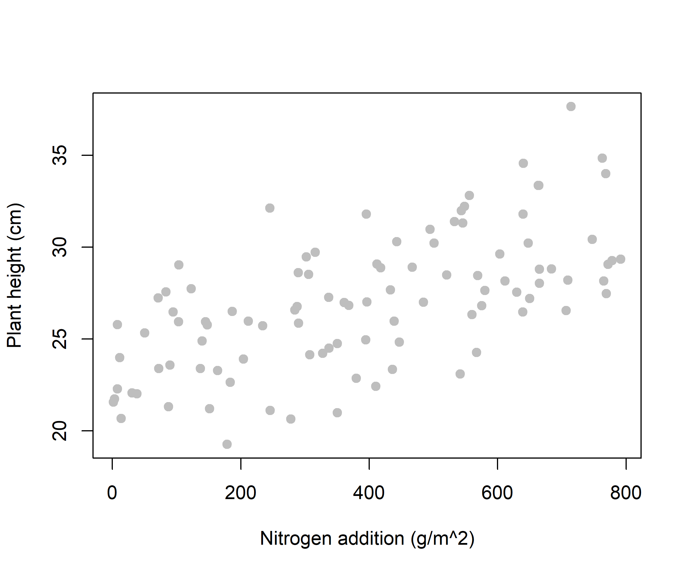
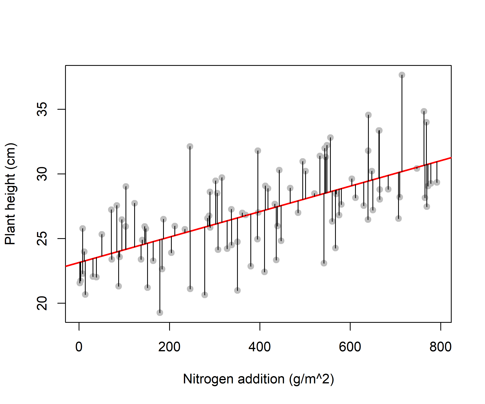
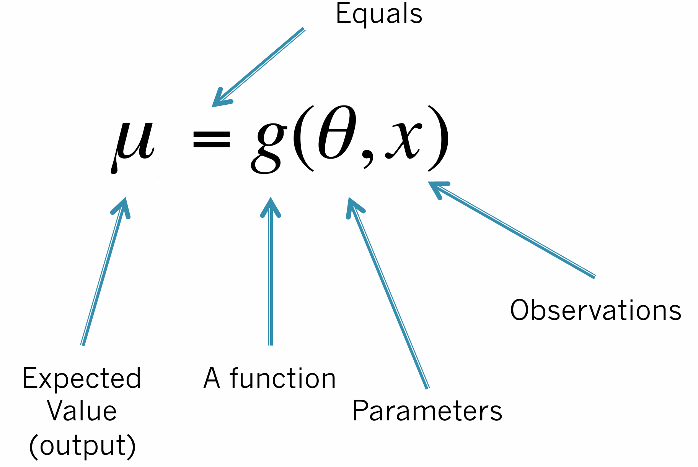
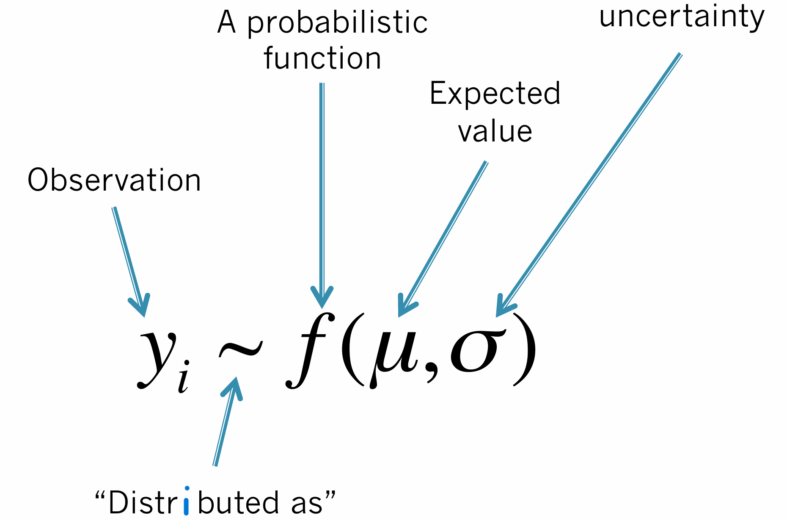



## Outline

1.  General Linear regression
2.  Generalized Linear regression
3.  Practice

# General Linear regression

## Why use GLM?

A linear model describes the relationship between a response and
explanatory variable(s), assuming:

::::: columns
::: {.column width="60%"}
- The model makes **biological sense**
- **Independence** of errors (blocking, mixed effects models later)
- **Homoscedasticity** — equal variance of errors
- **Normality** of errors

$$y = b_0   \times X_0 + b_1    \times X_1 + b_2    \times X_2 + \ldots$$
:::

::: {.column width="40%"}

:::
:::::

## What is a GLM?

In a Gaussian linear model, the expected values are:

:::::: columns
:::: {.column width="60%"}
$$\mu = X \beta$$

and the errors follow a normal distribution:

$$y \sim    {Normal}(\mu, \sigma)$$

::: callout-note
But are the errors always normal? What if our response is a count, a
proportion, or presence/absence?
:::
::::

::: {.column width="40%"}

:::
::::::

## Model structure

Statistical models describe:

- **Systematic pattern** in a random variable (response), possibly as a
  function of covariates
- **Random (unexplained) variability** around the mean:

Response = systematic + random

::: callout-note
other pairs of terms: deterministic + stochastic, or mean + dispersion
structure of model
:::

## Key elements of a model

::::: columns
::: {.column width="50%"}
Deterministic process:

{style="width: 80%"}
:::

::: {.column width="50%"}
Stochastic process:\
{style="width: 80%"}
:::
:::::

> Why do we need both? Deterministic part is a mathematical model of a
> process while stochastic part is a statistical model of data that
> arise from the process.

## Basic regression model

*Deterministic process*: What biological process underlies the pattern
in my data?

*Stochastic process*: What probabilistic process produces the values of
my data?

$$y_i = \beta_0 + \beta_1 x_i + \epsilon_i, \qquad \epsilon_i \sim  {Normal}(0, \sigma^2)$$

is exactly the same as:

$$\mu_i = \beta_0 + \beta_1 x_i, \qquad y_i \sim    {Normal}(\mu_i, \sigma^2)$$

> **What if the errors aren't normal?**

## Common error distributions

::::: columns
::: {.column width="40%"}
{style="width: 80%"}
:::

::: {.column width="40%"}
{style="width: 80%"}
:::
:::::

The family for the errors can be: Gaussian for normally distributed data

> Other example error distributions include:

::: incremental
- Poisson for count data
- Binomial for success/failure data
- Bernoulli for presence/absence
:::

# Generalized Linear regression

## What is a GLM?

A GLM uses a **link function** $L$ to describe the relationship between
the mean response and the predictor:

$$L(E(y)) = \beta_0 + \beta_1 x$$

## Linear regression

$$E(y) = \beta_0 + \beta_1 x_1 + ... + \beta_n x_n$$

::: incremental
- The link is called ”identity”
- Produces μ on range (−∞, ∞)
- Possibility to add interaction effects (e.g., $\beta_3 x_1 x_2$) and
  curvilinear effects (e.g., $\beta_4 x_1^3$ )
- When should we not use a linear model?\
  – Simple linear models produce continuous predictions across the range
  of all real numbers\
  – Equations must provide predictions matched to the biological
  quantities we wish to understand
:::

## Intercept-only model: simulate data

Let's simulate observations as 1000 samples of body mass measurements of
male peregrines.

```{r}
rm(list = ls())
set.seed(1)
y1000 <- rnorm(n = 1000, mean = 600, sd = 30)
truth <- c(mean = 600, sd = 30)
hist(y1000, col = "grey",
     xlim = c(450, 750),
     xlab = "Body mass (g) of 1000 male peregrines",
     main = "")
```

## Intercept-only: frequentist

As we did last week, we can analyse these data using canned software.
There are R packages to fit linear models using frequentist inference
methods (e.g., lm() or glm() from stats package), or Bayesian inference
(e.g., brms package).

```{r}
lm1   <- stats::lm(y1000 ~ 1)
c(coef(lm1), sigma = sigma(lm1))
truth
```

## Intercept-only: Bayesian

We could also use general-purpose software to fit models. In this
lesson, you will see how to fit linear models using R package ”nimble”.
When we use R packages, we need to learn the syntax and provide the
required input and format. First, make sure the required packages are
installed and loaded into R. Second, bundle data in a list. Third, write
the Nimble model in BUGS language.

```{r}
#| cache: true
library(nimble) # model fitting
library(coda)   # output processing

list_data <- list(mass = y1000, n = length(y1000))

model_1 <- nimbleCode({
  # Likelihood
  for (i in 1:n) {
    mass[i] ~ dnorm(mean = pop_mean, sd = pop_sd)
  }
  # Priors
  pop_mean ~ dunif(0, 5000)
  pop_sd   ~ dunif(0, 100)
})


```

## Intercept-only: Bayesian

We use Markov Chain Monte Carlo simulations to draw samples from the
posterior distribution of our parameters of interest. For this, we need
additional input, including starting values for MCMC chains, parameters
we want monitored, and MCMC settings.

```{r}
#| cache: true
inits  <- list(pop_mean = rnorm(1, 600), pop_sd = runif(1, 1, 30))
params <- c("pop_mean", "pop_sd")
ni <- 3000; nb <- 1000; nc <- 4; nt <- 1
```

## Intercept-only: Bayesian

We generated starting values and saved them in a list, saved a vector of
the parameter names, and finally, determined how many MCMC chains and
iterations we need, how many samples to keep, and how many samples to
discard. Now, we can fit this model:

```{r}
#| cache: true
out1 <- nimbleMCMC(code      = model_1, 
                   constants = list_data,
                   inits     = inits,
                   monitors  = params,
                   nburnin   = nb,
                   niter     = ni, 
                   thin      = nt,
                   nchains   = nc,
                   summary   = TRUE,
                  samplesAsCodaMCMC = TRUE)

```

## Intercept-only: Bayesian

The model output will be a list. To show its contents we could use
lapply(), as shown below. You should always inspect the model outputs.

```{r}
#| cache: true
lapply(out1, head)
par(mfrow = c(1, 2))
coda::traceplot(out1$samples)
out1$summary$all.chains # Posterior summaries from all 4 chains
```

## Linear regression with covariate: simulate data

Let’s generate some data, including a response (body mass measurements
of male peregrines during cold months) and a continuous covariate, e.g.,
temperature in Celsius.

```{r}
set.seed(1)
truth <- c(a = 600, b = -0.5, mean = 0, sd = 10)
x   <- runif(1000, 1, 10)
eps <- rnorm(length(x), truth["mean"], truth["sd"])
y   <- truth["a"] + truth["b"] * x + eps
plot(y ~ x, pch = 19, col = "grey")
```

> Note that we do not measure eps in reality; we measure x.\
> Visualizing the resulting data in this example is similar to
> visualizing the data you collected in the field (y) in addition to
> your explanatory variable (x).

## Linear regression with covariate: frequentist

Let’s use the same function as before to fit the regression line that
describes the relationship between response and explanatory variables.

```{r}
lm2   <- stats::lm(y ~ x)
summary(lm2)
plot(y ~ x, pch = 19, col = "grey")
abline(lm2, col = "red", lwd = 2)
# show the residuals
fit <- predict(lm2)
segments(x, fit, x, fit + residuals(lm2))
```

## Linear regression with covariate: Bayesian

As before, we need to bundle data in a list and write the nimble model
in BUGS language. We generate starting values and save them in a list,
save a vector of the parameter names, and finally, determine how many
MCMC chains and iterations we need, how many samples to keep, and how
many samples to discard.

```{r}
#| cache: true
list_data <- list(mass = y, n = length(y), temp = x)

model_2 <- nimbleCode({
  # Likelihood
  for (i in 1:n) {
    # Response y distributed normally
    mass[i] ~ dnorm(mu[i], sd = sd)
    # Linear predictor
    mu[i]   <- a + b * temp[i]
  }
  # Priors
  a  ~ dunif(0, 5000)
  b  ~ dnorm(0, 0.001)
  sd ~ dunif(0, 100)
})

inits  <- list(a = rnorm(1), b = rnorm(1), sd = runif(1, 1, 10))
params <- c("a", "b", "sd")
ni <- 4000; nb <- 2000; nc <- 4; nt <- 1
# Model fitting
out2 <- nimbleMCMC(code      = model_2,
                   constants = list_data,
                   inits     = inits,
                   monitors  = params,
                   nburnin   = nb,
                   niter     = ni,
                   thin      = nt,
                   nchains   = nc,
                   summary   = TRUE,
                   samplesAsCodaMCMC = TRUE
)
out2$summary$all.chains
```

## Linear regression with covariate: frequentist

We can also use the glm() fucntion to fit the regression line.

```{r}
glm2  <- stats::glm(y ~ x)         # identity link = same as lm()
summary(glm2)
c(coef(glm2), sigma = sigma(glm2))
plot(y ~ x, pch = 19, col = "grey")
abline(glm2, col = "red", lwd = 2)
fit <- predict(glm2)
segments(x, fit, x, fit + residuals(glm2))
```

> The default is "identity" link. What if the response is not
> continuous?

## Exponential model

$$log(E(y)) = \beta_0 + \beta_1 x_1 + ... + \beta_n x_n$$

::: incremental
- Models quantities that are only positive
- Produces μ on range (0, ∞)
- Preserves the additive simplicity of linear
- “We used a log-transformed response variable”
- “We used a linear model with a log link”
:::

## Poisson GLM: simulate data

Relationships with count data as the response can be modeled using
Poisson GLM. A logarithmic link is used between the expectation of the
response (i.e., the mean count) and the predictor function (i.e., the
combination of parameters on the right side of the regression equation).
As a result, exponentiated coefficient estimates are the multiplicative
effect on the count (response) of one unit increase in the predictor.

```{r}
set.seed(500)
n           <- 300
habitat     <- factor(rep(c("forest", "grassland"), each = n/2))
temperature <- runif(n, -5, 25)

a <- 1; b_hab <- 1.5; b_temp <- 0.1; b_temp2 <- -0.005
truth <- c(a = a, b_hab = b_hab, b_temp = b_temp, b_temp2 = b_temp2)

lambda <- exp(a +
              b_hab  * (habitat == "grassland") +
              b_temp  * temperature +
              b_temp2 * temperature ^ 2)
set.seed(300)
count  <- rpois(n, lambda)

plot(count ~ temperature,
     col = habitat,
     pch = 19,
     cex = 0.6)
legend("topleft",
       legend = levels(habitat),
       col = 1:2, 
       pch = 19,
       bty = "n")
```

## Poisson GLM: frequentist

We can use glm() to fit a generalized linear model to count data by
specifying the "poisson" link. Similar to a linear model, we can make
predictions as below.

```{r}
glm3 <- stats::glm(count ~ habitat + temperature + I(temperature^2),
                       family = "poisson")
summary(glm3)

new_data <- expand.grid(habitat = levels(habitat), temperature = -5:25)
new_data$fit <- predict(glm3, newdata = new_data, type = "response")
plot(count ~ temperature, col = habitat)
for(h in c("forest","grassland")) {
  lines(fit ~ temperature,
        new_data[new_data$habitat == h, ],
        type = "l",
        lwd = 2,
        col = habitat)
}

fit <- predict(glm3, type = "response")
segments(temperature,
         fit,
         temperature,
         fit + residuals(glm3,
                         type = "response"))

```

## Poisson GLM: Bayesian

We can fit the same model using nimble():

```{r}
# Bundle data
list_data <- list(count   = count,
                  n       = length(count),
                  habitat = as.numeric(habitat) - 1,
                  temp    = temperature)
# Model code
model_2 <- nimbleCode( {
  # Likelihood
  for(i in 1 : n) {
    # Response y is from Poisson distribution
    count[i] ~ dpois(lambda[i])
    # Linear predictor
    log(lambda[i]) <- a +
                      b_hab * habitat[i] +
                      b_temp * temp[i] +
                      b_temp2 * temp[i] ^ 2
  }
  # Priors
  a ~ dunif(0, 10)
  b_hab ~ dnorm(0, 0.001)
  b_temp ~ dnorm(0, 0.001)
  b_temp2 ~ dnorm(0, 0.001)
} )
# Initial values
inits <- list(a = rlnorm(1),
              b_hab = rnorm(1),
              b_temp = rnorm(1),
              b_temp2 = rnorm(1))
# Parameters monitored
params <- c("a", "b_hab", "b_temp", "b_temp2")
# MCMC settings
ni <- 10000 ; nb <- 5000 ; nc <- 4 ; nt <- 1
# Model fitting
out2 <- nimbleMCMC( code      = model_2,
                    constants = list_data,
                    inits     = inits,
                    monitors  = params,
                    nburnin   = nb,
                    niter     = ni,
                    thin      = nt,
                    nchains   = nc,
                    summary   = TRUE,
                    samplesAsCodaMCMC = TRUE)
```

## Logistic regression

$$logit(E(y)) = \beta_0 + \beta_1 x_1 + ... + \beta_n x_n$$

::: incremental
- Models quantities that are proportions
- Produces μ on range (0, 1)
- Preserves the additive simplicity of linear
- “We used a linear model with a logit link”
:::

## Logistic regression: simulate data

Let’s simulate a different response. When the response is a probability,
a proportion, or a success/failure, we can fit logistic (or binomial)
regression. Here we simulate data with a binary response (0/1) and two
predictors, one continuous (age) and one categorical (sex). We then fit
a logistic regression model and use it to make predictions.

```{r}
set.seed(2007)
n   <- 1000
sex <- factor(sample(c("F", "M"), n, replace = TRUE, prob = c(0.3, 0.7)))
age <- runif(n, 0, 15)
# Specify odd-ratios
or_sex <- 0.5; or_age <- 1.3
truth  <- c(a = qlogis(0.3),
            b_sex = log(or_sex),
            b_age = log(or_age))

# True survival probability
surv_p <- plogis(qlogis(0.3) +
                 log(or_sex) * (sex == "M") +
                 log(or_age) * age)
set.seed(2009)
surv <- rbinom(n, 1, surv_p)
plot(surv ~ age,
     col = sex,
     pch = 19, 
     cex = 0.3,
     ylab = "Survived (0/1)")
```

## Logistic regression: frequentist

We can fit a logistic regression model using the glm() function. We need
to specify the family as ”binomial”.

```{r}
glm4 <- glm(surv ~ sex + age, family = "binomial")
summary(glm4)
exp(coef(glm4))   # odds ratios
#The estimated intercept (as a probability)
exp(coef(glm4)[1])/(exp(coef(glm4)[1]) + 1)
```

## Predictions: logistic regression

We can make predictions from this model. As before, we create a new
dataframe and use the predict function.

```{r}
new_data     <- expand.grid(sex = levels(sex), age = 0:15)
new_data$fit <- predict(glm4, newdata = new_data, type = "response")

plot(surv ~ age,
     col = sex,
     pch = 19, 
     cex = 0.3,
     ylab = "Pr(survival)")
for (s in c("M", "F")) {
  lines(fit ~ age,
        new_data[new_data$sex == s, ],
        lwd = 2, 
        col = ifelse(s == "M", "black", "red"))
}
legend("topright",
       legend = c("M", "F"),
       col = c("black", "red"), 
       lwd = 2, 
       bty = "n")
```

> Note that type = "response" in predictions from Poisson and logistic
> regression.

## Logistic regression: Bayesian

We can fit the same model using nimble().

```{r}
#| cache: true
list_data <- list(surv = surv,
                  n = length(surv),
                  sex = as.numeric(sex) - 1,
                  age = age)

model_3 <- nimbleCode( {
  # Likelihood
  for(i in 1 : n) {
    # Response y is from Binomial distribution
    surv[i] ~ dbern(p[i]) # the same as dbinom(p[i], 1)
    # Linear predictor
    logit(p[i]) <- a + b_sex * sex[i] + b_age * age[i]
  }
  # Priors
  a ~ dnorm(0, 0.001)
  b_sex ~ dnorm(0, 0.001)
  b_age ~ dnorm(0, 0.001)
} )

# Starting values
inits <- list(a = rnorm(1),
b_sex = rnorm(1),
b_age = rnorm(1))
# Parameters monitored
params <- c("a", "b_sex", "b_age")
# MCMC settings
ni <- 10000 ; nb <- 5000 ; nc <- 4 ; nt <- 1
# Model fitting
out3 <- nimbleMCMC(code      = model_3,
                   constants = list_data,
                   inits     = inits,
                   monitors  = params,
                   nburnin   = nb,
                   niter     = ni,
                   thin      = nt,
                   nchains   = nc,
                   summary   = TRUE,
                   samplesAsCodaMCMC = TRUE)
out2$summary$all.chains
```

## Predictions: logistic regression

```{r}
#| cache: true
new_data <- expand.grid(sex = levels(sex), age = 0:15)
# Compute posterior means -----
a_mean <- out3$summary$all.chains["a","Mean"]
bage_mean <- out3$summary$all.chains["b_age","Mean"]
bsex_mean <- out3$summary$all.chains["b_sex","Mean"]
new_data$binary_sex <- (as.numeric(new_data$sex) - 1)
new_data$fit <- cbind(ilogit(a_mean +
                             new_data$binary_sex * bsex_mean +
                             new_data$age * bage_mean ))
plot(surv ~ age, col = sex)
for(s in c("F","M")) {
  lines(fit ~ age,
        new_data[new_data$sex == s,],
        type = "l",
        lwd = 2,
        col = sex)
}

```

> Can you add a legend to this plot to show what colors represent?

## Predictions: logistic regression

We can compute 95% Bayesian credible intervals around predictions.

```{r}
#| cache: true
a_lci <- out3$summary$all.chains["a","95%CI_low"]
bage_lci <- out3$summary$all.chains["b_age","95%CI_low"]
bsex_lci <- out3$summary$all.chains["b_sex","95%CI_low"]
new_data$lci <- cbind(ilogit(a_lci +
                             new_data$binary_sex * bsex_lci +
                             new_data$age * bage_lci))
plot(surv ~ age, col = sex, pch = 19, cex = 0.3,
     ylab = "Pr(survival)")
for(s in c("F","M")) {
  lines(lci ~ age,
        new_data[new_data$sex == s,],
        type = "l",
        lty = 2,
        col = sex)
}

```

> Can you repeat find the upper uncertainty bound and add the line
> similar to above?

## Your turn

::: {.callout-tip title="Practice"}
You should now be able to identify what kind of data (response variable)
you have and specify an appropriate regression model to describe the
relationship between response and explanatory variables.

1.  **What biological process** underlies the pattern in your data?
2.  **What probabilistic process** produces the values of your data?
3.  Fit an appropriate model (Gaussian, Poisson, or Binomial) to your
    own data using `nimble package`.
:::
